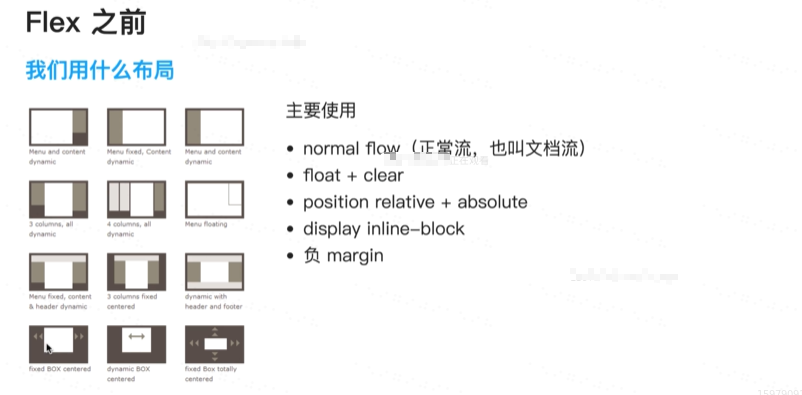
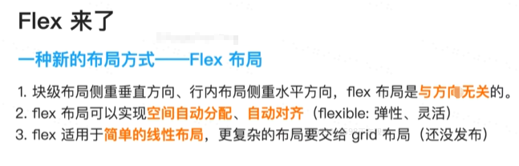
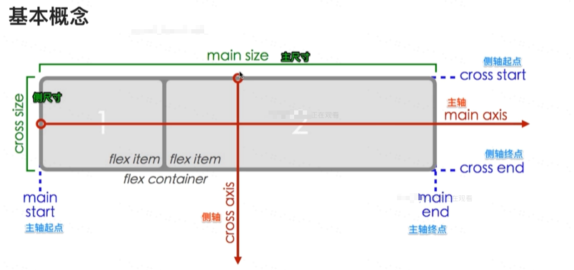
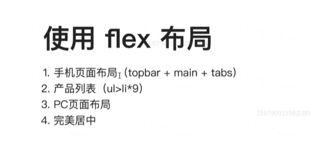
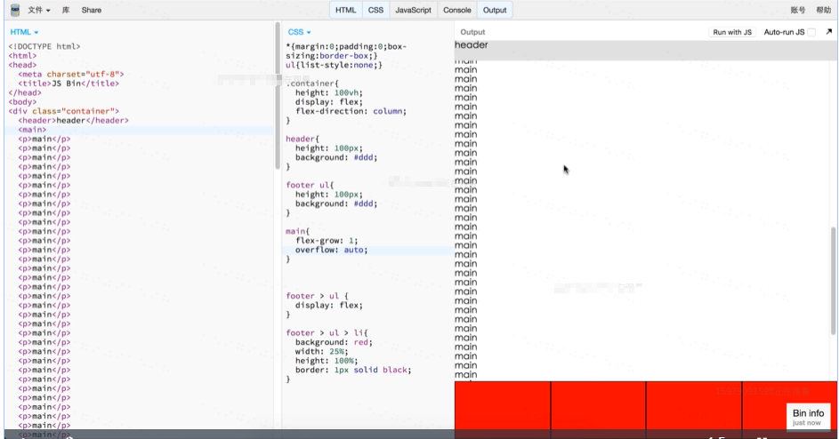
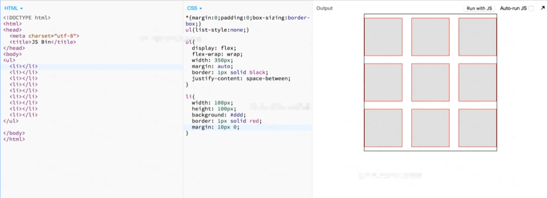
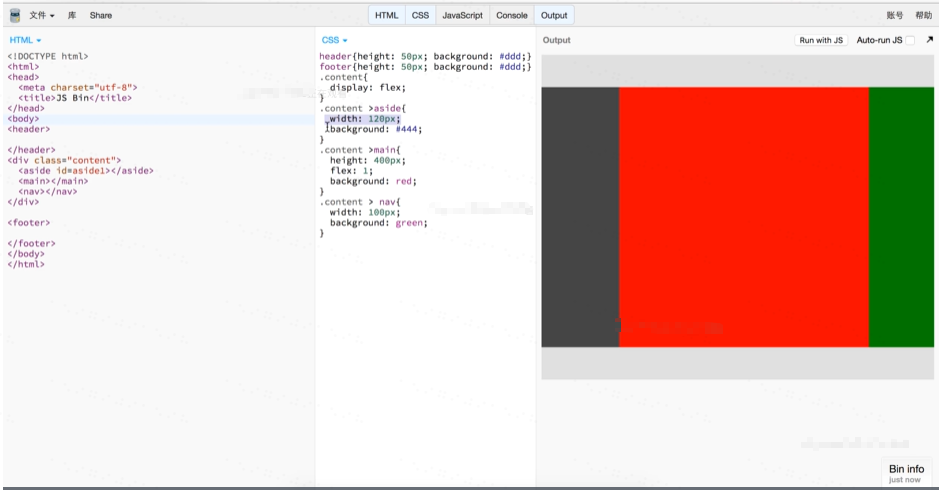
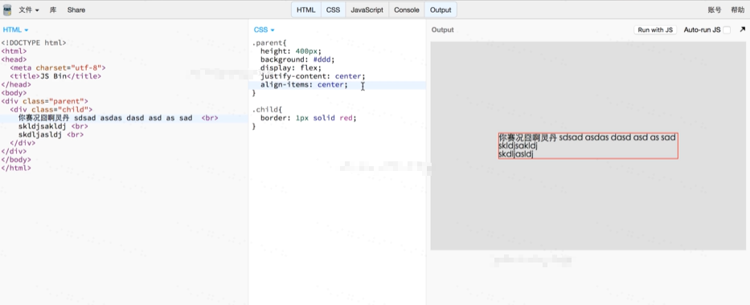

# Flex 学习

> 学习参考资料：[Flex-阮一峰](http://www.ruanyifeng.com/blog/2015/07/flex-grammar.html)

## 写在前面

## Flex 基本概念

## Flex Container 属性

主要有 6 个属性：

- `flex-direction` ：方向
- `flex-wrap`： 换行
- `flex-flow` ：上面两个的简写
- `justify-content` ：主轴方向对齐方式
- `align-items` ：侧轴对齐方式
- `align-content`：多行 / 列 内容对齐方式 （用的比较少）

## Flex Item 的属性

主要有 6 个属性：

- `flex-grow` ： 增长比例（空间过多时）
- `flex-shrink` ： 收缩比例（空间过小时）
- `flex-basis` ： 默认大小（一般不用）
- `flex` ： 上面 3 个的缩写
- `order` ： 顺序（替代双飞翼布局，但是 ie8 不支持）
- `align-self` ： 自身的对齐方式

## 使用 Flex 布局

- 手机页面布局 ：

- 产品列表实现

- PC 页面布局

- 实现完美居中

## 学习资料

小游戏： [flex-study-game](http://flexboxfroggy.com/#zh-cn)