## 文档流（Normal Flow）

### 块级元素的宽高

1. 块级元素的高度

关于块级元素的宽高，可能面试官会问你这样的问题：

面试官：下面页面中，div 的高度为多高？

```html
<!DOCTYPE html>
<html>
<head>
  <meta charset="utf-8">
  <title>JS Bin</title>
</head>
    <body>
        <div>1</div>
    </body>
</html>
```

显而易见，div 内为空，通过开发者工具我们可以知道，高度为 0；

面试官：此时，下面页面中，设置字体大小为 20px ，div 的高度为多高？

```html
<!DOCTYPE html>
<html>
<head>
  <meta charset="utf-8">
  <title>JS Bin</title>
  <style>
  div{
    border: 1px solid red;
    font-size: 20px;
  }
  </style>
</head>
<body>
  <div>1</div>
</body>
</html>
```

通过设置 border 的 css 我们可以通过开发者工具知道此时 div 的高度。

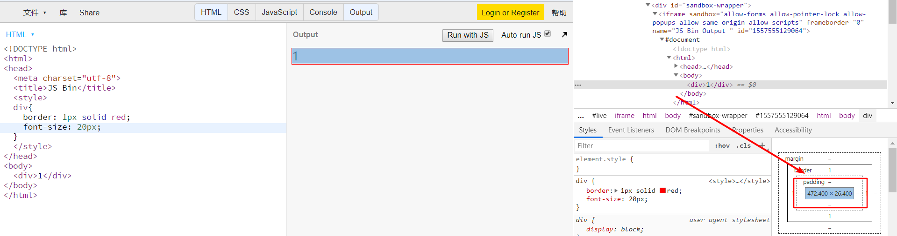

此时，我们可能会认为：26.4 / 20 = 1.32

认为行高为 1.32

**这时，你可能会有答案：div 的高度和行高有关。**

但是，

换成其他字体，发现高度又变了？

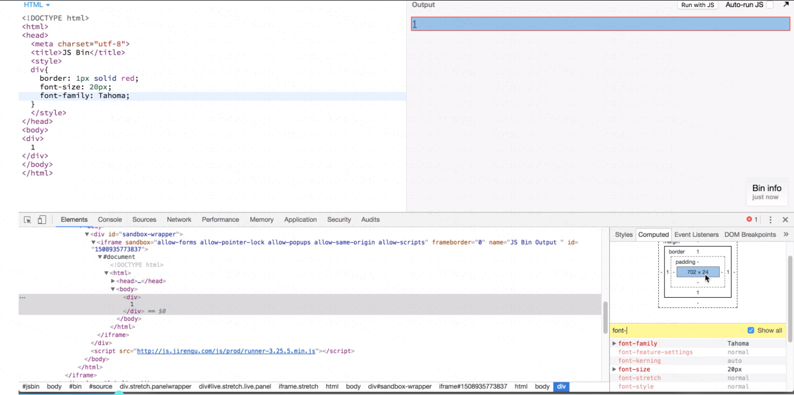

**此时，你可能又会有答案： div 的高度和字体有关，不同字体的高度是不同的。**

此时，面试官可能又会问你：那你知道不同字体的高度是多少吗？

？？？顿时哑巴。

OK，以上都是为了引出今天要讲的话题——字体设计与 div。

如下图：

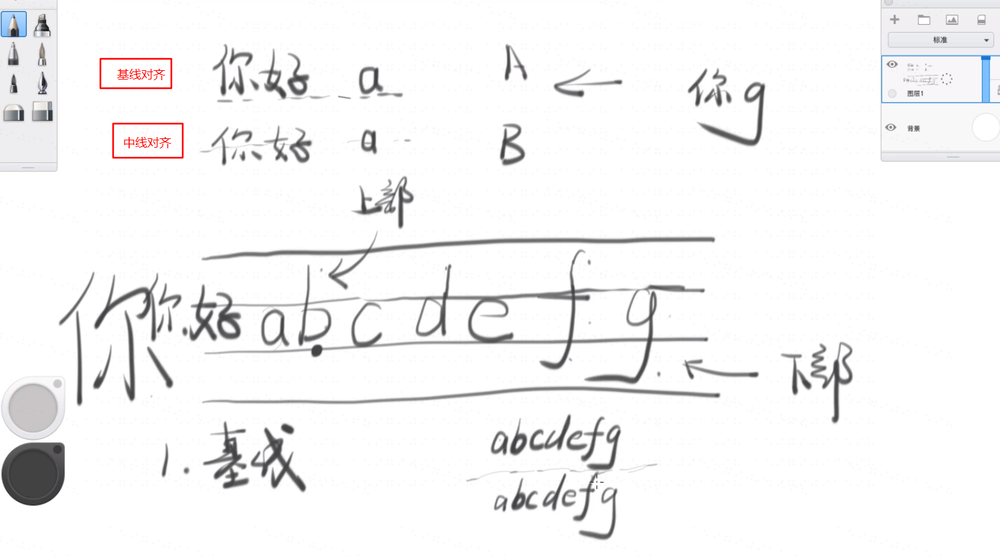

平时我们写字的时候，你有细心发现的话，我们书写的**字都是按照基线对齐**的，而不是**中线对齐**的，这种例子很简单，就是当你在写中文和英文的时候，如英文字母 f 和 g ，会在四线三格的位置中分别占据 【上部，中部，下部】和【中部，下部】的位置，而不同的字母和汉字都基本是在【中部和上部】的位置。

鉴于上述情况，每个字母或者汉字的【高度】不同，那么为了使汉字和字母在【多行显示的情况下尽可能美观】，设计师必须考虑到【行与行之间的间距是多少】。

此时，**设计师为其设置了一种【建议行高】的规定**，这就是**字体的默认行高**，有的是字体大小的 1.2 倍，有的是 1.3 倍甚至是 3 倍。通常上述信息写在了字体文件中可以看到。

这样一来，我们就可以轻松理解 **不同字体的高度是不同的**。

当然，我们也可以自定义行号 `line-height`，需要注意的是，当`line-height` 值设置的过小的时候，**小于字体的默认值时，字体大小则不会变的更小。**

2. 块级元素的宽度：

- 空格合并：当字与字之间有多个连续空格时，`html` 默认会为其显示成一个空格；
  但是为了使**上下的字体两边能对齐**，很多人常犯的错误，使用 `&nbsp;` 作为空格。
- （因为这里有个坑，不同字体设计师的空格代表不同的字体大小。如这里，6个空格表示2个字，即3个空格表示1个字，但是不同字体可能是不一样的）

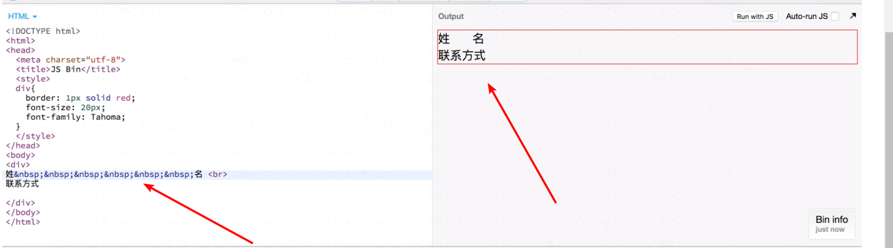

那么，上述方法不能使用，该用什么办法呢？

参考答案： `text-align: justify`

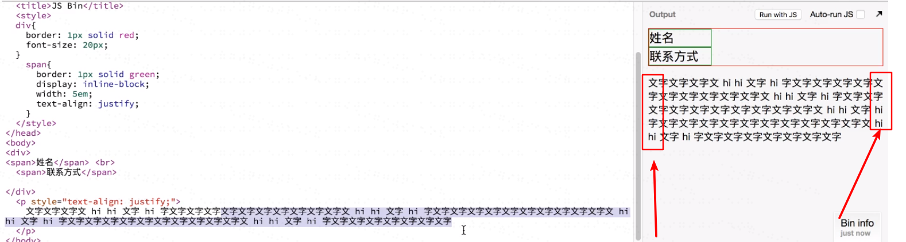

上述对齐方式有个问题，就是**它只适应在多行文本的时候，使两边的字体和上下文的字体对齐。**

**那还有办法吗？**

当然有，使用 `::after`

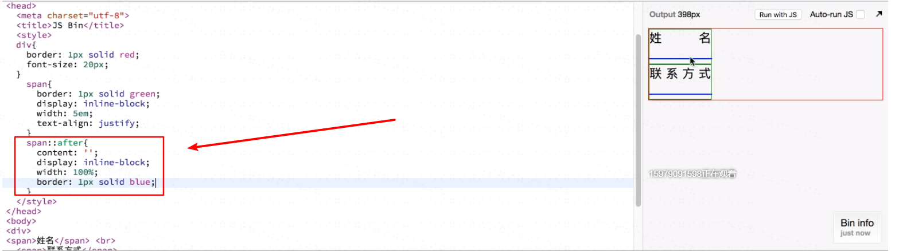

我们给它加上蓝色的边框作为调试，即可看到。

实际上我们也可以看出来，使用这种方式还是在 `text-align: justify` 的基础之上的，只不过我们是添加了两个空行而已。

但是，问题来了，这两个空行（蓝色部分）它也占据了一定的行高，为了获得更好的效果，有办法把它去掉吗？

也是有的。

**添加三行代码**：

```css
line-height: 20px;
overflow: hidden;
height: 20px;
```

即，设置行高和高度一致，然后让多出的部分隐藏不可见即可实现效果。

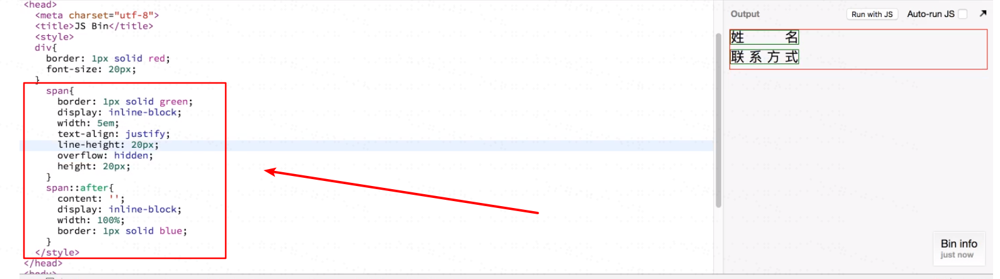

3.HTML 元素中，除了元素两端的空格，元素内部的空格（和回车）都会被浏览器看成是一个空格。

例子1：回车导致的空格

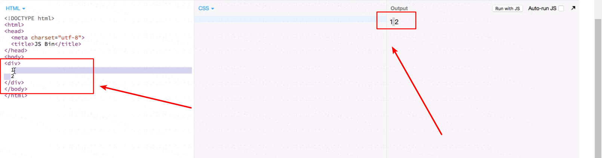

例子2：内联元素之间的回车，会被看成是空格

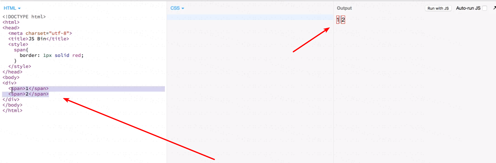

例子3：不管是` inline` 元素还是 `inline-block` ，都会有空格

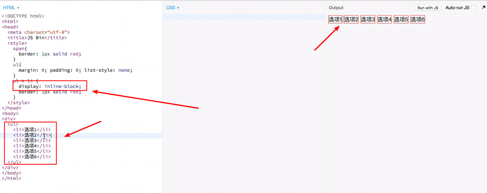

那怎么办？如何处理上述例子中的问题？

**答案：**不要用 `inline` 或者 `inline-block` 换成 `float: left;` 和 清除浮动 `clearfix`

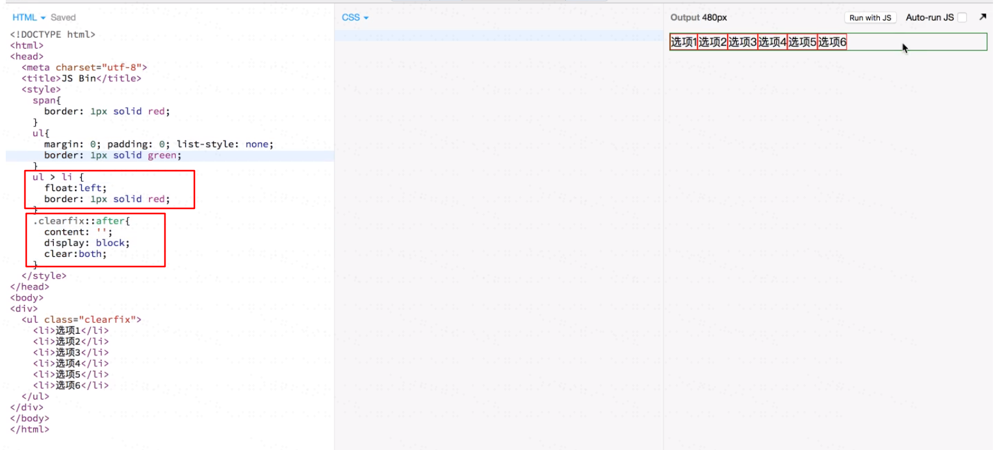

这样一来，元素之间就不会有多余的空格。

4. 文档流 / 如果内联元素足够多，会变成响应式。

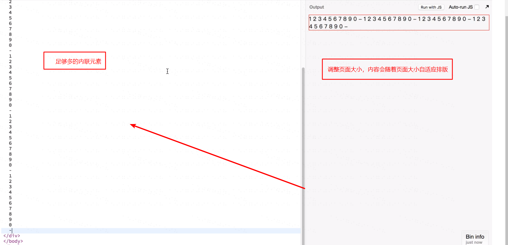

5.遇到问题： 当出现下面的情况时，为什么第二行不会跟上第一行后面，而是单独一行还溢出了 div 宽度？ 

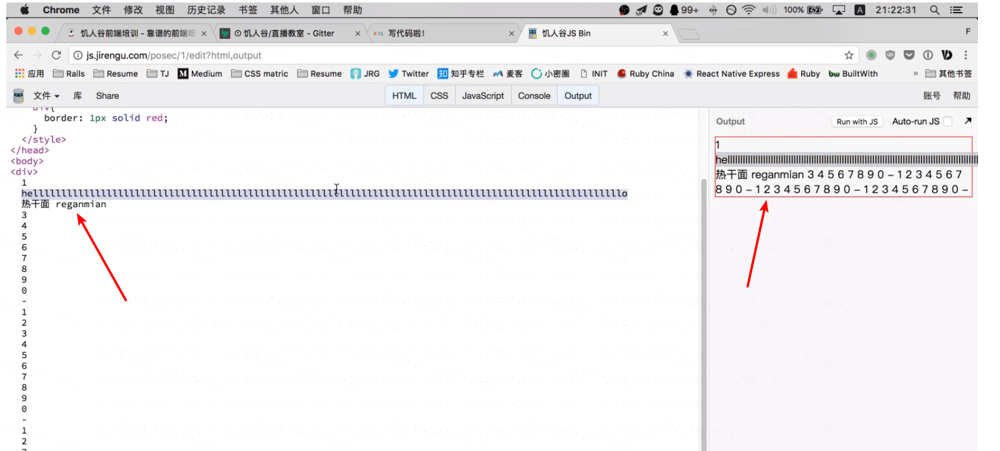

这种原因是因为：外国人思考中，**连续的字母是一个单词**，既然是一个单词，**就被浏览器看成一个内联元素**，偏偏这个内联元素的宽度超过了div 的宽度，为此就溢出了。

那么，有什么办法处理这种问题呢？

这本来不是一个问题，因为没有这么长的单词，而要解决这种问题，有2个办法：

（1）使用**单词的连字符**来处理即可

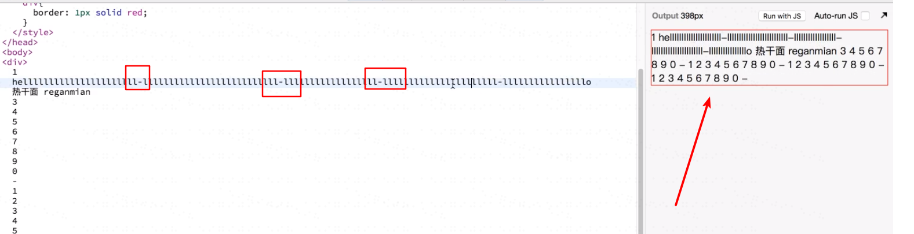

（2）不用连字符，就用 `word-break: break-all`

```css
word-break: break-all;
```

效果如下：

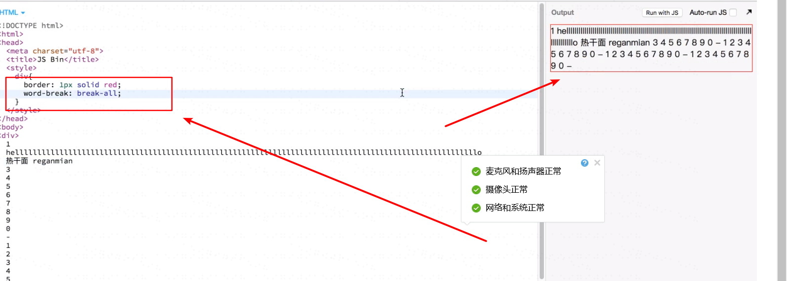


### 文字溢出省略

1. 实现多行文本合并成一行

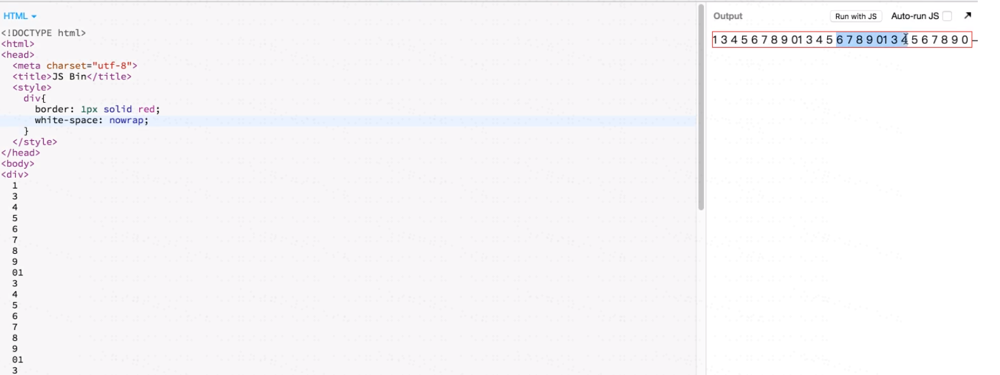

使用 `white-space: nowrap;` 

但是这里需要注意，**合并后的文字会往右横向排列，且 div 的宽度不会随着文字的长度而变长**。

2. 文字溢出省略

上面，我们实现了多行文本合并成一行，但是还没有实现【文字溢出省略】

方法如下：

```
div{
	border: 1px solid red;
	white-space: nowrap;
	overflow: hidden;
	text-overflow: ellipsis;
}
```

效果如下：

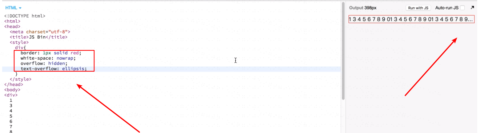

如果忘记了上述方法，怎么办？

**谷歌，关键词搜索：【css multi line text ellipsis】，记住，搜英文的方式更高效。**

翻译成中文为 【css 多行 文本 省略号】，谷歌搜索到答案：[Line Clampin' (Truncating Multiple Line Text) | CSS-Tricks](https://css-tricks.com/line-clampin/)

### 文字垂直居中

需求：要求内容的高度为 40px，内容居中。

错误做法：写死高度

```css
div{
	height: 40px;
	text-align: center;
}
```

正确做法：

```css
div{
	line-height: 24px;
	padding: 8px 0;
	text-align: center;
}
```

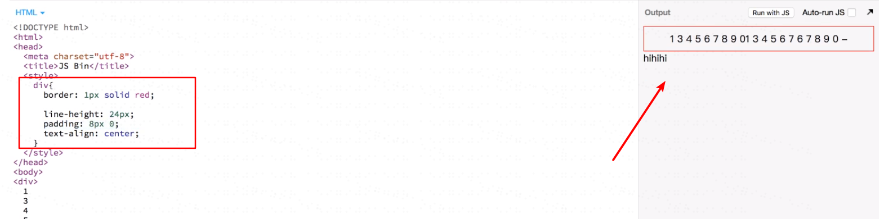

### margin 边距合并

主要体现在 **父子边距合并**，如下图：

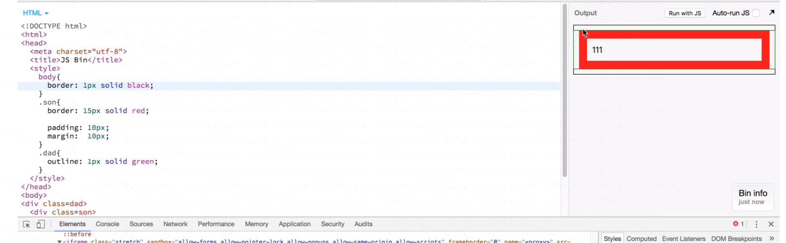

子元素的边距值超出了父元素的范围内，溢出到外面去了。

即**当父元素没有什么东西遮挡或者包裹其内的子元素时，会造成父子元素的边距合并。**

怎么处理？

父元素添加 `padding` 或者设置 `border` 挡在上下边距之间，即可避免父子元素的边距合并。

- 父元素添加 padding 实现的效果

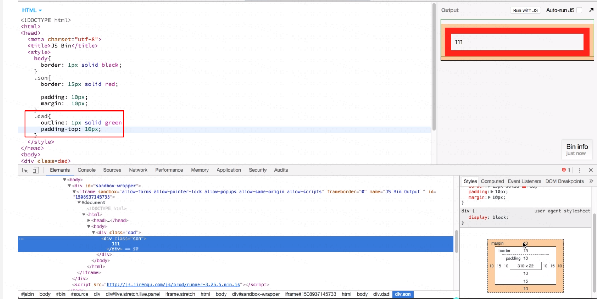

- 父元素设置 border 实现的效果

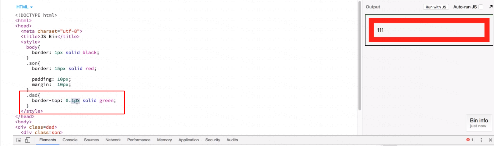

- 父元素设置 overflow**【不推荐】**

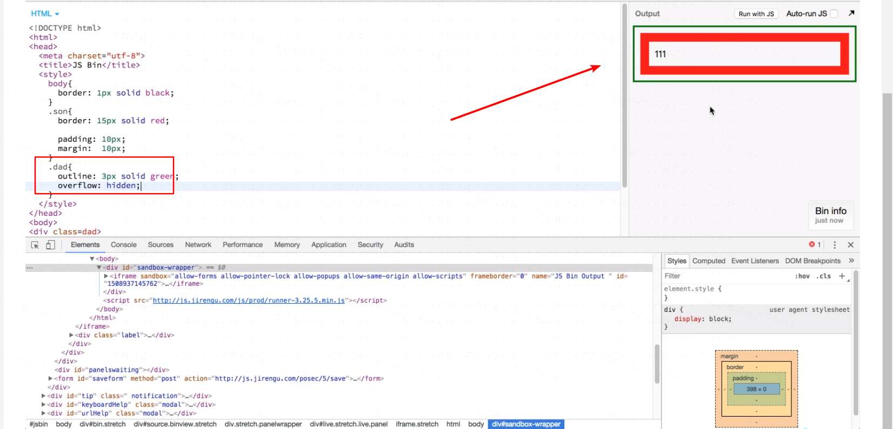

**原因：当有其他需求在父元素内部设置悬浮层时，不能超过父元素的位置，否则不可见，影响后面的开发。**

- 使用内联元素隔离父子元素

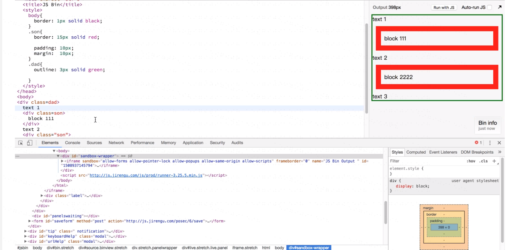


### 总结

div 的高度：由其内部文档流中元素总和决定的。

脱离文档流：主要有三种

- `flota:left` 浮动元素脱离文档流
- `position:absolute / fixed` 绝对定位脱离文档流

### CSS 调试方法

- border 方法
- outline 方法
- 二者区别： outline 设置边框宽度，不会占据盒模型中的宽度。 border 的宽度会占据盒模型中的宽度。

