# TypeScript 学习

> 官网： [typescript](https://www.typescriptlang.org/docs/home.html)
>
> 中文官网： [typescript](https://www.tslang.cn/docs/handbook/typescript-in-5-minutes.html)
>
> 慕课网学习视频：[TypeScript入门](https://www.imooc.com/video/13522)

## 基本介绍

- 来自微软公司
- 是 javaScript 的超集
- 支持 ES6 语法

## 其他介绍

- 学习 TS 的好处
- 安装 TS 的开发环境
- TS 的概念，语法，特性等

## TS 的优势

- 支持 ES6 规范
- 强大的 IDE 支持
- Angular 的开发语言

## 在线 Compiler

- 什么是 compiler
- 使用 在线 [compiler](https://www.tslang.cn/play/index.html)

## 本地 compiler

- 安装： `npm install -g typescript`
- 创建：`touch Hello.ts` 
- 内容：

```js
export class Hello{
    
}
```

## 字符串新特性

### 字符串新特性：

- 多行字符串
- 字符串模板
- 自动拆分字符串

```
使用 ` 替换 " " ，解决换行问题；如果有变量，使用 ${variable} 的形式表达
```

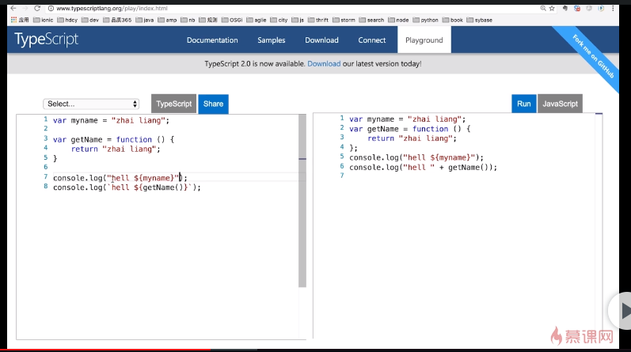

自动拆分字符串，怎么理解？

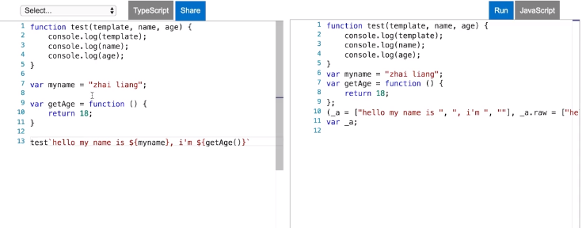

我们看这里，定义一个函数，调用的时候传入字符串模板，然后，函数会去自动获取其内部的变量作为参数。我们可以运行后查看结果。

## 参数新特性

### 参数类型

在参数名称后面使用 **冒号** 来指定参数的类型

- 常用的几种类型：
  - `string`
  - `number`
  - `boolean`
  - `any`
  - `void` 函数返回值类型为 void
  - 自定义类型
- 类型的书写位置：
  - 变量中声明
  - 函数中声明
  - 函数参数中声明

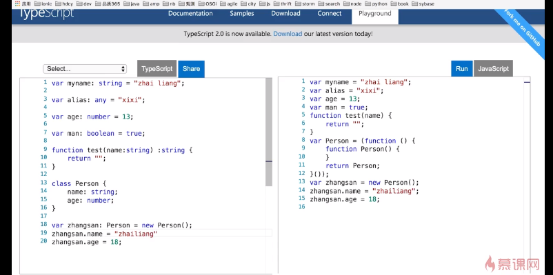


### 参数默认值

在参数声明后面时使用 **等号** 来指定默认值

- 变量指定默认值
- 方法的变量指定默认值，注意，带默认值的参数要放在最后面的位置，避免当调用方法时传入参数个数不够多时，无法获取真实的值


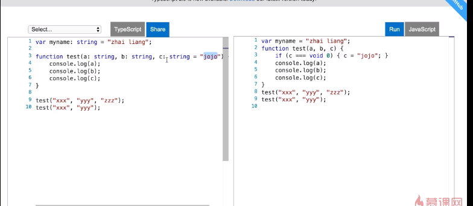


### 可选参数

在方法的参数声明后面用 **问号** 来标明此参数为可选参数

如下图，变量 b 后面有个 ？，表示 b 参数为可选参数；

此时，当我们调用该方法时，可以只传入一个参数，因为第二个参数为可选参数，第三个参数带有默认值。

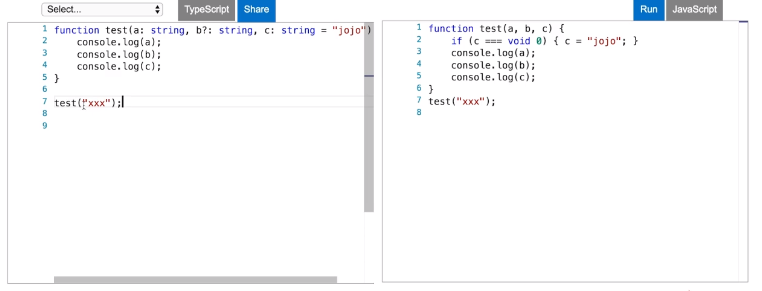

调用结果为：

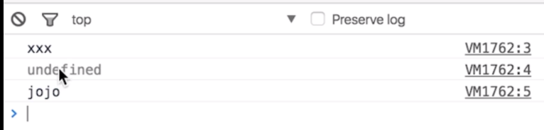


## 函数新特性

### Rest and Spread

用来声明任意数量的方法参数。

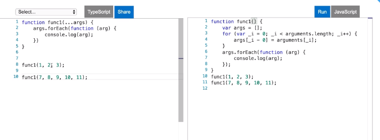

右边是左侧 TS 转成 ES5 的效果

另一种用法是 ES6 支持，但是 TS 当前不支持的使用方式：

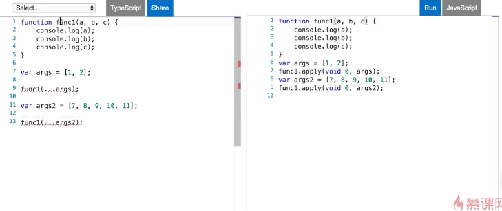

打印结果为：

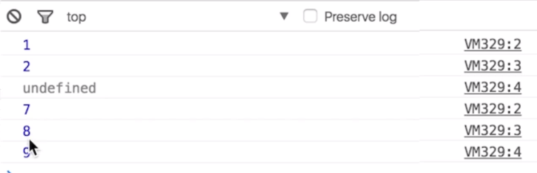

因为第一次调用方法时传入的参数为 1，2； 而方法本身接受 3 个参数，所以最后一个打印出来的为 undefined。

第二次调用时，多传入了一个参数，但是方法只能识别前几个参数，所以打印出来的结果没有 10 和 11。


### generator 函数

可以控制函数的执行过程，手工暂停和恢复代码执行。

在 [babel-test](https://www.babeljs.cn/repl#?babili=false&browsers=&build=&builtIns=false&spec=false&loose=false&code_lz=Q&debug=false&forceAllTransforms=false&shippedProposals=false&circleciRepo=&evaluate=false&fileSize=false&timeTravel=false&sourceType=module&lineWrap=true&presets=es2015%2Creact%2Cstage-2&prettier=false&targets=&version=7.6.0) 进行测试，我们可以看到：

```js
function* doSomething() {
  console.log("start");
  
  yield; // 类似一个断点
  
  console.log("end");
}

doSomething() // 调用函数不会执行

var func1 = doSomething() // 需要将该函数赋值给另一个变量

func1.next(); // 使用 next 方法让函数执行,打印 start，遇到 yield 暂停
func1.next();  // 执行函数，打印出 end
```


接着，我们来看看更复杂的需求

使用最便宜的价格购买股票

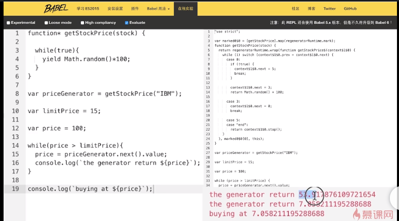

```js
function* getStockPrice() {
  while(true) {
    yield Math.random()*100;
        }
}

var priceGenerator = getStockPrice("IBM");

var limitPrice = 15;

var price = 100;

while(price > limitPrice) {
	price = priceGenerator.next().value;
  console.log(`the generator return ${price}`);
}

console.log(`buying at ${price}`)
```

### destructuring 析构表达式

通过表达式将对象或数组拆解成任意数量的变量。

原代码：

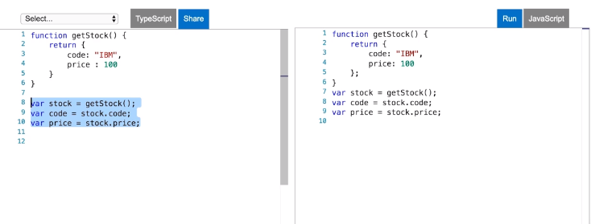

使用析构表达式的方式实现相同的效果

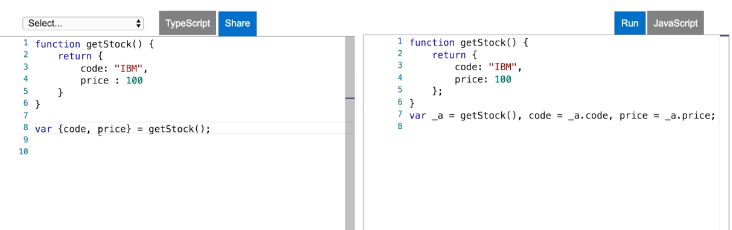

注意几个地方：

- 定义的变量名必须和函数内的 key 值名一致
- 如果需要更改析构的变量名，请使用如下方式：

```js
function getStock() {
    return {
        code: "IBM",
        price: 100
    }
}

var { code: codex, price } = getStock(); // 取名为 codex
console.log(codex); // IBM
```

- 如何取到嵌套的属性的值

```js
function getStock() {
    return {
        code: "IBM",
        price: {
            price1: 200,
            price2: 400
        }
    }
}

var { code: codex, 
     price: {
         price1
     } 
    } = getStock(); // 取名为 codex

console.log(price1); // 200
```


上面，我们知道了如何从 对象 里以析构表达式的方式取到对应 key 的值，下面我们来学习如何从 数组 里以析构表达式的方式取到对应 key 的值。

我们举例以下几种使用方式

方式1：使用 `[]` 对数组进行析构，里面的变量对应数组的位置的值

```js
var array1 = [1,2,3,4];
var [number1, number2] = array1;

console.log(number1, number2); // 1, 2
```

方式2：位置可以变化

```js
var array1 = [1,2,3,4];
var [, , number1, number2] = array1;

console.log(number1, number2); // 3, 4
```

方式3： 使用剩余参数的方式获取析构的值

```js
var array1 = [1,2,3,4];
var [number1, number2, ...others] = array1;

console.log(number1, number2); // 1, 2
console.log(others) // [3,4]
```

方式4：作为函数的参数使用

```js
var array1 = [1.2.3.4];

function doSomething([number1, number2, ...others]) {
    console.log(number1, number2); // 1, 2
    console.log(others) // [3,4]
}

doSomething(array1);
```


## 表达式与循环

### 箭头表达式

用来声明匿名函数，消除传统匿名函数的 this 指针问题

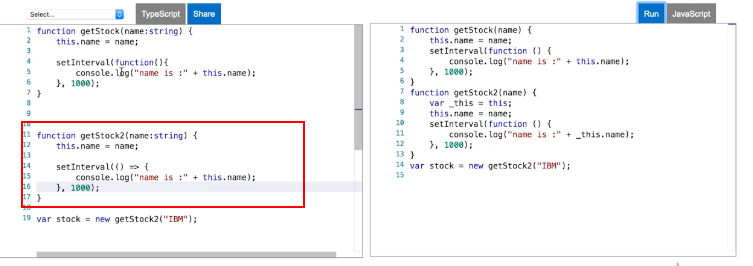s

### for of 循环

对比 forEach， for in 

forEach 

- 会忽略我们定义的属性
- 无法 break

```js
var newArray = [1,2,3,4];
newArray.desc = "forEach"

newArray.forEach(value => console.log(value)); // 1,2,3,4
```

for in

```js
var myArray = [1,2,3,4];
myArray.desc = "for in";

for(var n in myArray) {
    console.log(n); // 0 1 2 3 desc  打印出都是 key 值
}

for(var n in myArray) {
    if(n > 2) break;
    console.log(n); // 1 2  这样获取的才是 value 值
}
```

for of

- 获取到的是 value 值
- 可以 break
- 无法读取新定义的属性

```js
var myArray = [1,2,3,4];
myArray.desc = "for in";

for(var n of myArray) {
    console.log(n); // 1 2 3 4 
}
```


## 面向对象特性

### 类

主要有几个知识点：

- 使用 `class` 来声明类
- 使用 `new` 关键字来创建类的 对象 / 实例，使用时，会调用其 constructor 构造函数
- 类的属性没有使用 `public,private,protected` 修饰时，默认为 public ，即类的 内部和外部 均可访问
- `private` 表示类的属性只允许类的 内部访问
- `protected` 表示类的属性只允许类的 内部和 其子类访问
- 在 javaScript 中，类的实现主要是使用 `prototype` 来实现的
- 类的继承 extends 和 super

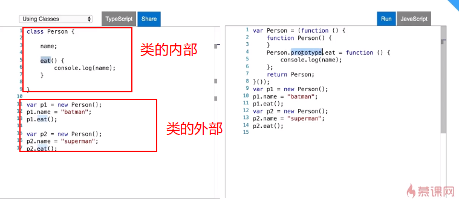

```js
class Person{
    constructor(public name: string) {
       this.name = name;
    }
    eat() {
        console.log(name);
    }
}

var p1 = new Person("hello");
p1.eat();

var p2 = new Person("world");
p2.eat();
```

这里，注意个地方：

```js
constructor(name: string) { // 没有类型声明， name 只是一个参数
       this.name = name;
}

constructor(public name: string) { // 含有类型声明，name表示 class 中的一个属性，类型为 public
       this.name = name;
}

// 以下 2 种写法相等
class Person{
    constructor(public name: string) {
       this.name = name;
    }
}

class Person{
    public name;
    constructor(name: string) {
       this.name = name;
    }
}
```


下面，我们来学习 类的继承 和 super

```js
class Person{
    constructor(public name: string) {
       this.name = name;
    }
    eat() {
        console.log("eat");
    }
}

class Boss extends Person{
    // 表示 Boss 继承了 Person，拥有 Person 的所有属性和方法
}

Boss b1 = new Boss("boss-1");
b1.eat();
```

- 子类的构造函数，必须调用 父类的构造函数，使用 super 关键字。

```js
class Person{
    constructor(public name: string) {
       console.log("haha");
    }
    eat() {
        console.log("eat");
    }
}

class Boss extends Person{
   constructor(name: string, code: string) {
       super(name);
       console.log("xixi");
       this.code = code;
   }
    code: string;
	work() {
        console.log("work");
    }
}

Boss b1 = new Boss("boss-1", "111");
b1.work();
```

- 使用 `super.xxx()` 调用父类的方法

```js
class Person{
    constructor(public name: string) {
       console.log("haha");
    }
    eat() {
        console.log("开始吃饭...");
    }
}

class Boss extends Person{
   constructor(name: string, code: string) {
       super(name);
       this.code = code;
   }
    code: string;
	work() {
        super.eat(); // 使用 super 调用父类的方法
        this.doWork();
    }
	private doWork() {
        console.log("开始搬砖");
    }
}

Boss b1 = new Boss("boss-1", "111");
b1.work();

b1.doWork() // 错误，不能在类的外部调用含有 private 修饰的方法
```


### 泛型

参数化的类型，一般用来限制集合的内容。

看以下代码；

```js
// 省略上面的代码...
var workers: Array<Person> = [];
workers[0] = new Person("zhangsan");
workers[1] = new Boss("lisi", "123")
workers[2] = 123; //报错，类型不匹配
```

### 接口

用来建立某种代码约定，使其开发者在调用某个方法或创建新的类必须遵循接口所定义的代码约定。

使用方式1：作为类的构造函数参数类型

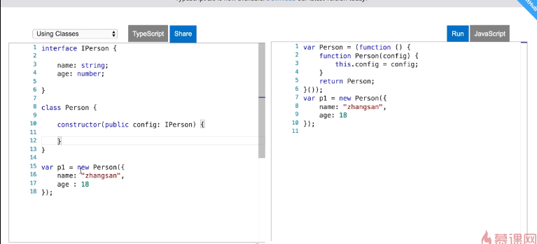

使用方式2：使用 implements 方式实现，需要实现接口的方法

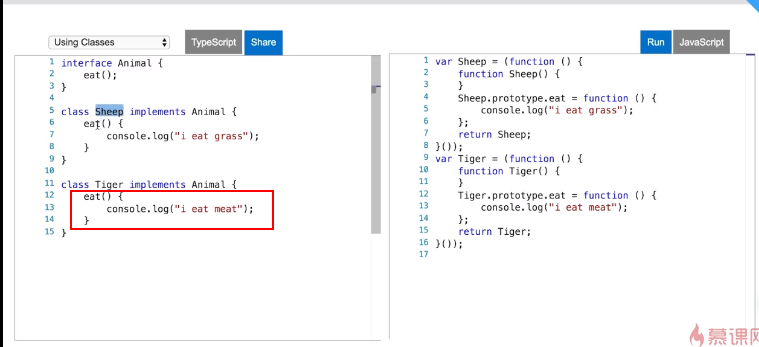

### 模块

模块可以帮助开发者将代码分割为可重用的单元。

开发者可以自己决定将哪些资源（类，方法，变量）暴露出去供外部使用，哪些资源只在模块内使用。

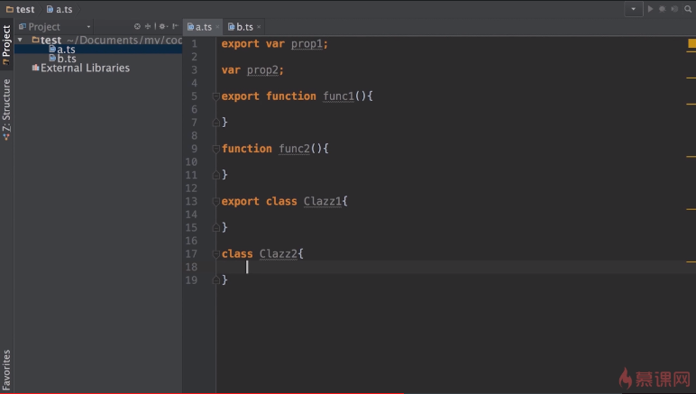


### 注解 annotation

注解为程序的元素（类，方法，变量）加上更直观更明了的说明，这些信息说明程序的业务逻辑无关，而是供指定的工具或框架使用的。

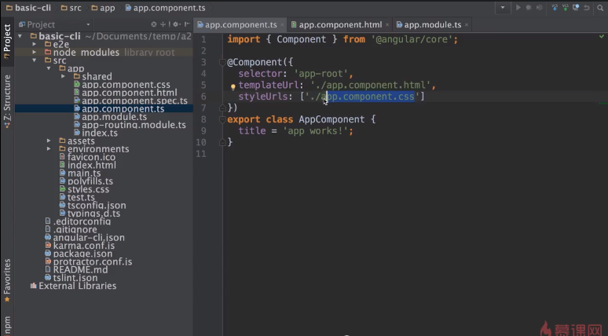

### 类型定义文件

`XXX.d.ts` 文件

安装工具：[typings](https://github.com/typings/typings)

