# Vim学习

> 学习教程参考慕课网 [玩转Vim 从放弃到爱不释手](https://www.imooc.com/learn/1129) ，此处为学习笔记


## 01-玩转 Vim 从放弃到爱不释手

### 前置知识：几种模式

- 普通（浏览）模式
- 插入模式
- 可视化模式


## 02-初识 Vim，想说爱你不容易

【课程 2-1 】

### 几条常用命令

1. 使用字母 a / i / o 进入插入模式

|  命令  |         含义          |
| :----: | :-------------------: |
| 小写 i |     光标前面插入      |
| 大写 I | 光标所在 【行首】插入 |
| 小写 a |      光标后插入       |
| 大写 A | 光标所在 【行末】插入 |
| 小写 o | 光标【下一行】 开新行 |
| 大写 O | 光标【上一行】 新开行 |

2. 设置行号：normal 模式下   `:set nu`  （默认是没有行号的）
3. 全局替换：normal 模式下 `:% s/java/python/g` ，表示全局情况下，将所有 `java` 换成 `python` ，其中，`:% s` 表示替换, `/g` 表示全局


【课程 2-2】

### Visual 模式

按下字母 `v` 进入 visual 模式

按下方向键即可对字符进行选择，常用操作：选择（整行），删除，复制，粘贴

| 命令       | 含义         |
| ---------- | ------------ |
| 大写字母 V | 选择整行     |
| 小写字母 y | 复制当前选择 |
| 小写字母 d | 删除选中     |
| Ctrl + v   | 块状选择     |


【课程 2-3】

### Vim 插入模式小技巧

1. 使用字母 a / i / o 进入插入模式
2. 使用 ：
   1. Ctrl + h 删除上一个字符
   2. Ctrl + w 删除上一个单词
   3. Ctrl + u 删除当前行
   4. **以上命令可以适用在 Linux 终端 bash 上**

```bash
# 拓展：在终端下，还有一些别的快捷键命令：
Ctrl + a 快速移动到开头
Ctrl + e 快速移动到结尾
Ctrl + b 往前移动
Ctrl + f 往后移动
```

3. 从 insert  模式快速切换到 normal 模式（不建议使用 Esc 的方式）
   1. Ctrl + c   （可能导致和某些插件快捷键冲突）
   2. 或
   3. Ctrl + [
4. 使用 `gi` 快速回到【刚才编辑的位置】
5. 键盘选择参考：
   1. HHKB
   2. Poker2 

6. 让键盘适应工具：
   1. 选择 Esc 和 Ctrl 比较容易触碰到的键盘
   2. 使用 Vim 你可以使用 HHKB或者Poker2这种迷你键盘
   3. 使用软件修改键位，比如 CapsLock 改成频繁使用到的 Ctrl
7. 熟能生巧，如何练习？（形成肌肉记忆）
   1. Linux 和 Vim下有非常多的快捷键简化工作
   2. 尝试抛弃你的退格键，使用 Ctrl 快捷键来完成你的编辑删除工作
   3. 尝试修改而不是强迫自己使用难用的键位


【2-4】 快速移动大法

### 快速移动大法

1. 适应传统的 hjkl 大法

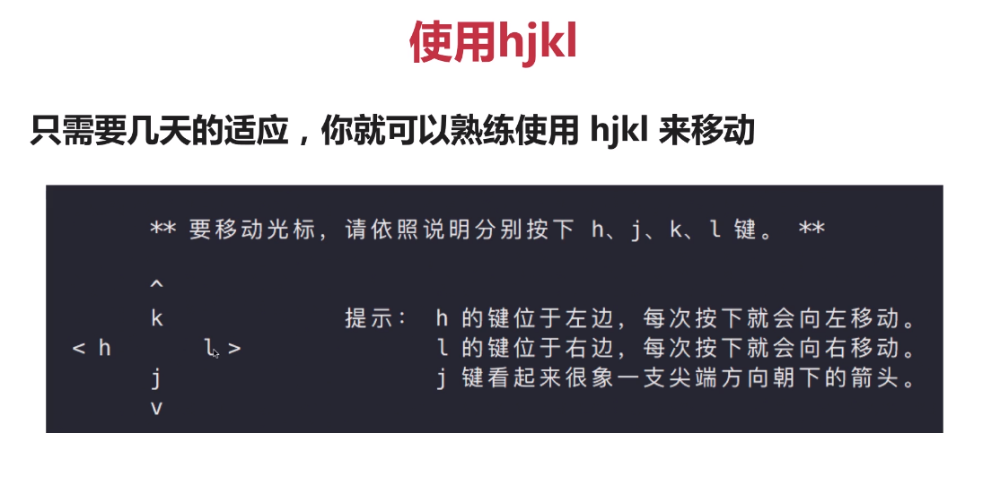

|                命令                 |                             含义                             |
| :---------------------------------: | :----------------------------------------------------------: |
|      **word 和 WORD  的区别**       | word 指【非空白符】分割的单词，WORD 指以【空白符【分割的单词 |
|             小写字母 w              |                     移到下一个 word 开头                     |
|               大写 W                |                     移到下一个 WORD 开头                     |
|               小写 e                |                     移到下一个 word 结尾                     |
|               大写 E                |                     移到下一个 WORD 结尾                     |
| 小写字母 b  （可以理解为 backword） |                     回到上一个 word 开头                     |
|             大写字母 B              |                     回到上一个 WORD 开头                     |

2. 设置语法高亮： `:syntax on`


【课程 2-4】

### 行间快速移动

1. 本质：**同一行快速移动的方式其实是搜索一个字符并快速移动到该字符**。

- 使用 `f{char}` 可以移动到 `char` 字符上， `t` 移动到 `char` 的前一个字符（t表示 until）
- 如果第一次没搜到，可以用 `(;)/逗号(,)` 继续搜改行下一个 / 上一个  （分号或者逗号）
- 大写的 F 表示反过来搜前面的字符

记住，以上操作都是在**同一行**中快速移动

2. Vim 水平移动

- 0 移动到行首第一个字符，^ 移动到第一个非空白字符，或者是 替换方案，使用 0 ，然后按下 w 即可移动到行首非空白字符
- $ 移动到行尾，g_ 移动到行尾非空白字符
- 通常，**记住 0 和 $** 就可以满足日常需求了

3. Vim 垂直移动（使用场景不太多）

我们还可以在句子(sentences) 和 段落(paragraph) 间移动（不常用）

- 使用括号 `() `在句子中移动，你可以用 `:help(` 来查看帮助
- 使用 `{}` 在段落之间进行移动 
- 后面插件章节，会讲述如何使用 `easy-motion` 插件移动，这些命令就不用记啦~

3.页面移动

翻页命令太多，根据 2/8 定律，记住常见的即可满足需求

-  `gg / G` 移动到**文件（页面）**开头和结尾，你可以使用 Ctrol + o 快速返回
- H / M / L 跳转到**【屏幕】**开头 （head） ，中间（Middle）和结尾（Lower） 
- Ctrl  + u.  Ctr + f. 上下翻页(upward / forward)。zz 把屏幕设为中间。

以上，对上述命令勤加练习，形成肌肉记忆。


【课程2-5】

### Vim 快速增删改查

1. Vim 快速删除一个字符或一个单词

- Vim 在 normal 模式下使用 x 快速删除一个字符
- 使用 d (delete) 配合文本对象快速删除一个单词，如： `daw` 表示 `d around word` 删除光标所在的单词包括其空格
  - `daw` 删除光标所在的单词包括其空格
  - `dw`  删除光标以后的一个单词包括空格
  - `diw` 删除光标所在的单词，不包括空格 
  - `d$` 快速删除到行尾
  - `d0` 快速删除到行头
  - `数字x` 表示删除几个字符，如 `2x` 表示删除光标往后的2个字符
- d 和 x 都可以配合数字执行多次

2. Vim 快速修改

- 常用有三个： r (replace) ，c (change) ，s (substitude)
- normal 模式下，使用 r 可以替换一个字符。s 替换并插入模式
- 使用 c 表示配合文本对象，我们可以快速进行修改
- 结合数字使用：`2c`,  `3s` , `4r`
  - 大写字母 R ，不断替换后面的字符
  - 大写字母 S，删除当前行，并进入插入模式
  - 大写字母 C, 删除当前行，并进入插入模式
- 常用命令:
  - `cw 或者 caw` 修改一个单词
  - `rw 或者 raw` 
  - `ct)"` 修改到 `)` 

3. 查询单词也是一种常用操作

> 通常会设置 `:set hls` 表示设置搜索关键词高亮，一般都会放在 vim 配置中，不需要单独设置
>
> 通常会设置 `:set incsearch` 表示增量搜索，即会变搜索边高亮，同样，都会放在 vim 默认配置中

- 使用 `/` 或者 `?` 进行前向或者反向搜索
- 使用 `n/N` 跳转到下一个或上一个匹配
- 使用 `*` 或者 `#` 进行当前单词的前向和后向匹配


【课程 2-6 】

### Vim 如何搜索替换

> substitude 命令允许我们查找并且替换掉文本，并且支持正则表达式

格式如下：

- `[range]s[ubstitude]/{pattern}/{string}/[flags]` 其中 `:`表示在命令模式下，`range` 表示范围，`/{pattern}` 表示模式， `string` 表示要替后的文本，`[flags]` 表示替换的标志位
  - `range` 表示范围，如：`10,20` 表示 10-20 行，`%` 表示全部
  - `pattern` 表示要替换的模式
  - `string`  是替换后的文本
  - `flag` 有几个常用的标志
    - `g(global)` 表示全局范围内执行
    - `c(confirm)` 表示确认，可以确认或者拒绝修改
    - `n(number)` 表示 number，报告匹配到的次数而不是替换，可以用来查询匹配次数 

举例如下：

1. `:% s/self/this/g` 表示将本文件中全部字符 中的 `self` 在  全局模式下 替换成 `this`

2. `:set num` 先设置行号，然后
3. `:1,6 s/self/this/g` 将第 1-6 行的 `self` 换成 `this` 

- 统计当前文本中某个字符出现的次数
  - `:1,6 s/self//n` 这里，`/self` 后面的 `/` 内容为空，然后 `[flag]` 使用 `n` 即可统计 `self`  出现的次数
- 使用正则的方法，替换单个单词而非含有该单词的其它方法 `:% s/\<quack\>/jiao/g` 

这样，下面的文本 中的 `quack` 

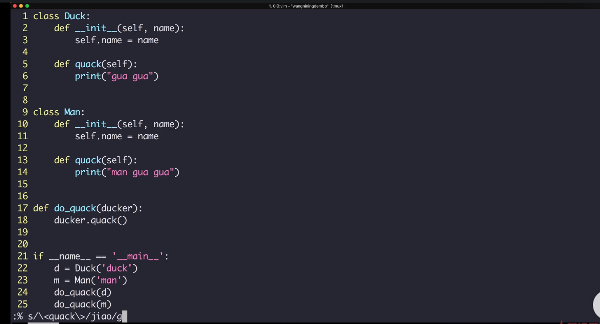

就会变成

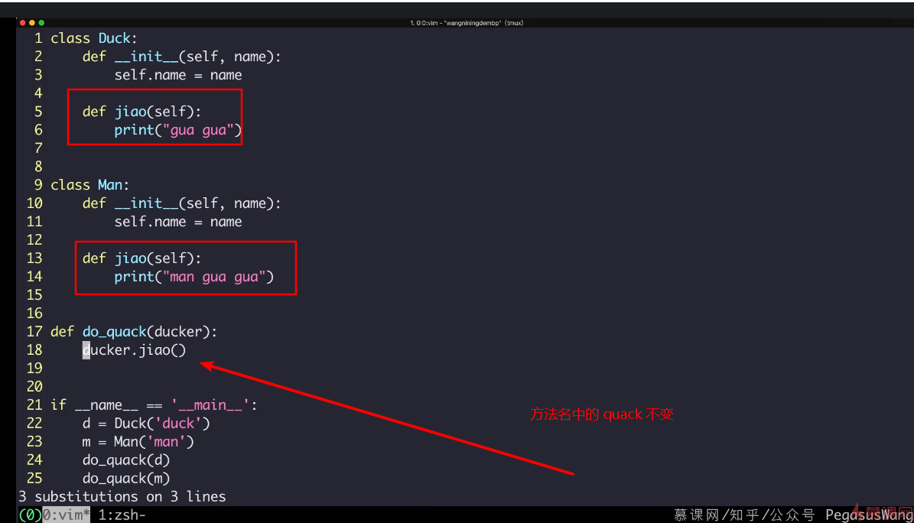


【课程 2-7】

### Vim 多文件操作

首先，了解一下 Vim 中的几个概念

- Buffer 表示打开的一个文件的内存缓冲区
- Window 窗口是 Buffer 可视化的分割区域
- Tab 可以组织窗口为一个工作区

如下图：

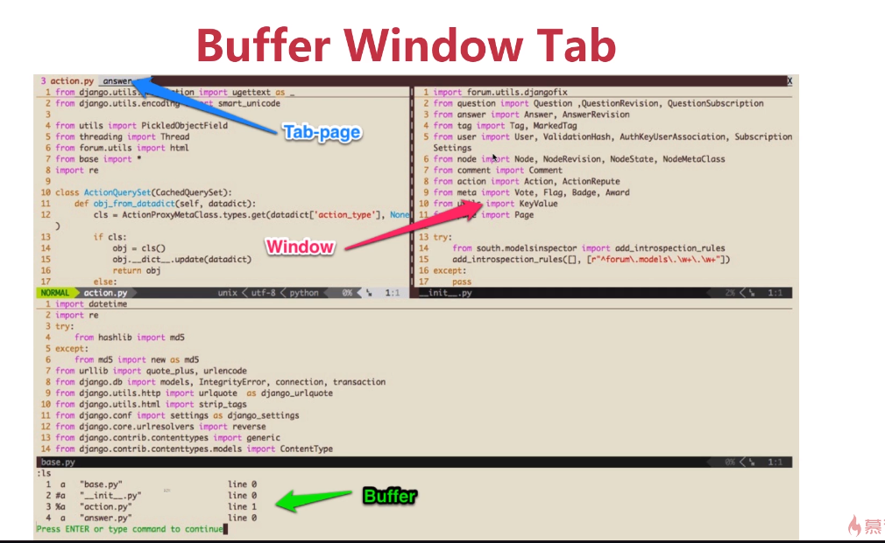

详细解释为：

1. Buffer ——什么是缓冲区？

-  Vim 打开一个文件后加载文件到内容缓冲区

- 之后的修改都是针对内存中的缓冲区，并不会直接保存到文件

- 直到我们执行 `:w（write)` 的时候才会把修改内容写到文件里

2. 如何在 Buffer 之间进行切换呢？

- 使用 `:ls` 会列举当前缓冲区，然后使用 `:b n` 跳转到第 n 个缓冲区
- `:bpre :bnext :bfirst :blast` 分表表示跳转到前一个，下一个，第一个，最后一个
- 或者可以使用 `:b buffer_name` 加上 tab 补全来跳转

3. 具体使用步骤：

```bash
vim-test/
├── a.txt
├── b.txt
└── vim.test
```

- `vi a.txt`
  - `:e b.txt` 此时改为编辑当前目录下的 b.txt 文件，此时，打开了 2 个缓冲区，分别为 a.txt 和 b.txt
  - `:ls`  查看缓冲区，看到 `a.txt 和 b.txt`
  - `:bpre` 使用 Tab 自动补全为 `:bprevious` 即 切换到前一个缓冲区
  - 使用 `:e a.txt` 编辑文件 a.txt

--------------

4. Window 窗口

窗口是可视化的分割区域：

- 一个缓冲区可以分割成多个窗口，每个窗口哦也可以打开不同的缓冲区
- `<Ctrl + w>s` 水平分割，`<Ctrl + w> v` 垂直分割。或者 `:sp` 和 `:vs`  其中，s 表示 split，v 表示 vertical
- 每个窗口可以继续被无限分割（看你屏幕够不够大）

（1）如何切换窗口

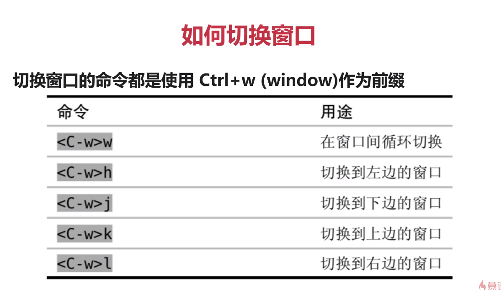

（2）如何重排窗口

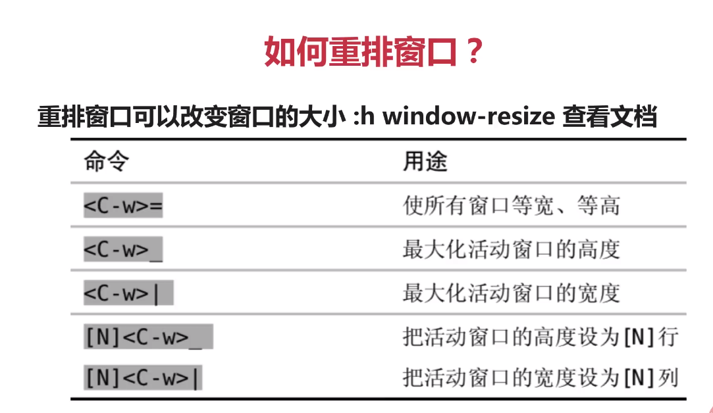

5. Tab （标签页）将窗口分组

Tab 是一个可以容纳一系列窗口的容器 (`:h tabpage`)

- Vim 的 Tab 和其他编辑器不太一样，可以想象成 Linux 的虚拟桌面
- 比如一个 Tab 全用来编辑 Python 文件，一个 Tab 全是 HTML 文件
- 相比窗口，**Tab 一般用的比较少**，Tab 太多管理起来也麻烦。

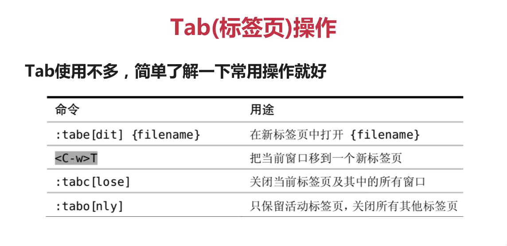

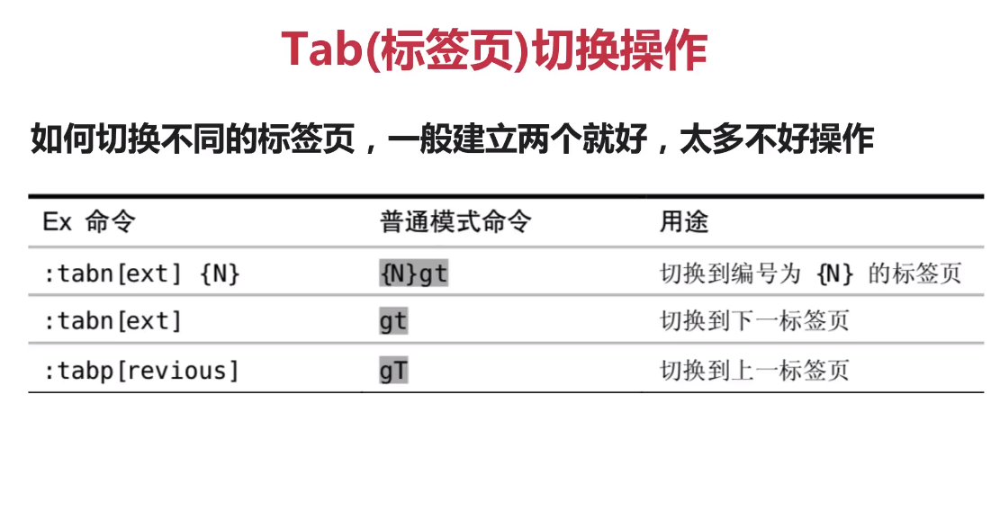


延伸：插件篇我们会配合 CtrlP 插件和 nerdtree 快速操作多个文件


【课程 2-8】

### 什么是 Vim 的 text object 

1. 如果你学过主流的编程语言，一定知道面向对象编程

- Vim 里面也有面向对象的概念，比如一个单词，一短句子，一个段落
- 很多其他编辑器经常只能操作单个字符来修改文本，比较低效
- 通过操作文本对象来修改比只操作单个字符要高效

2. 之前我们已经使用过文本对象了，回忆一下 `dw` （删除一个单词）

- `[number]<command>[text object]`
- number 表示次数，command 是命令， d (delete) ，c (change), y (yank)
- text object 是要操作的文本对象，比如单词 w ，句子 s ，段落 p


通过示例来学习


课后练习：

- 回忆一下如何删除一个单词？
- 在你的 Vim 中尝试使用文本对象快速增、删、改 一个单词
- 延伸：有些插件拓展了文本对象，比如 vim-go 可以使用 f 表示一个函数


【课程 2-9】

### Vim 复制粘贴与寄存器的使用

1. 初学者会感觉 Vim  复制粘贴比较奇怪，先从 **normal 模式**开始学习

- normal 模式下复制粘贴分别使用 y(yank) 和 p(put) ，剪贴 d 和 p
- 我们可以使用 v(visual) 命令选中所要复制的地方，然后使用 p 粘贴。
- 配合文本对象：比如使用 `yiw` 复制一个单词，yy 复制一行

**注意：Vim 里的剪贴（cut） 复制 (copy)  粘贴 (paste) 分别是 delete / yank / put**

2. 很多人会在使用鼠标进行选中，然后使用 Ctrl + v，或者 command + v 粘贴

- 这个和其他文本编辑器差不多， 但是粘贴代码有个坑：
- 很多人在 `.vimrc` 中设置了 autoindent ，粘贴 Python 代码锁紧混乱
- 这个时候，需要使用 `:set paste` 和 `:set nopaste` 解决

3. 什么是 Vim 的寄存器？

你有没有好奇？Vim 在normal 模式下复制 / 粘贴 的内容去哪了？

- Vim 里操作的**是寄存器而不是系统剪贴板**，这和其他编辑器不同。
- 默认我们使用 d 删除或者 y 复制的内容都放到了 “无名寄存器”中
- 用 x 删除一个字符放到无名寄存器，然后 p 粘贴，可以调换字符

深入寄存器：

Vim 里不使用单一剪贴板进行剪贴、复制、粘贴，而是多寄存器

- 通过 `"{register}` 前缀可以指定寄存器，不指定默认用无名寄存器
- 比如，使用 `"ayiw` 复制一个单词到寄存器 a 中，`"bdd` 删除当前行到寄存器 b 中
- 使用 `:reg a` 可查看寄存器 a 中的内容
- Vim 中，`""` 表示无名寄存器，缺省使用。 `"" p`  其实等同于 p

其他常见寄存器

除了有名的寄存器 a-z，Vim 还有一些其他常见寄存器

- 复制专用寄存器，`"0` 使用 y 复制文本同时会被拷到复制寄存器 0 
- 系统剪贴板， `"+` 可以在复制前加上 `"+` 复制到系统剪贴板
- 其他一些寄存器，比如 `"%` 当前文件名， `".` 上次插入的文本

> 将文本复制到系统剪贴板之前，需要先确定是支持改特性，使用 `echo: has('clipboard')` 查看，输出结果为 1 表示支持该特性。

**使用 `:set clipboard=unnamed` 可以让你直接复制粘贴系统剪贴板内容**


【课程 2-10】

### Vim如何使用宏完成强大的批量操作

如何使用 宏

- Vim 使用 q 来录制，同时也是 q 结束录制
- 使用 `q{register}` 选择要保存的寄存器，把录制的命令保存其中
- 使用 `@{register}` 回放寄存器中保存的一系列命令

 具体例子，如下，将所有连接都加上双引号

```html
https://www.imooc.com/video/19455
https://www.imooc.com/video/19455
https://www.imooc.com/video/19455
https://www.imooc.com/video/19455
https://www.imooc.com/video/19455
https://www.imooc.com/video/19455
https://www.imooc.com/video/19455
https://www.imooc.com/video/19455
https://www.imooc.com/video/19455
https://www.imooc.com/video/19455
https://www.imooc.com/video/19455
```

首先，我们示例给一行加上双引号

- 使用 `I` 来到开头，来到行首并进入插入模式，再按下双引号
- 按下 Esc 回到 normal 模式
- 按下 A 回到结尾，到达行尾并进入插入模式，按下双引号
- 按下 Esc 回到 normal 模式

如何把所有操作回放到所有行呢？使用 宏的方式

- 按下 q 开启寄存器，按下名字 a，左下角有 `recording @a`
- 重复上面操作
  - 使用 `I` 来到开头，来到行首并进入插入模式，再按下双引号
  - 按下 Esc 回到 normal 模式
  - 按下 A 回到结尾，到达行尾并进入插入模式，按下双引号
  - 按下 Esc 回到 normal 模式
- 按下 q 结束录制

接下来，要在每一行回放该宏，则可以使用 在命令行下执行 normal 模式下的命令

- 按下 shift + v，实现行选，按下大写字母 G 到最后一行
- 按下 `:` 则会自动变成 `:'<,>'`
- 输入 `normal @a`,变成 `:'<,>normal @a'`
- 回车，即可完成 在所有行实现给链接加上双引号

以上，可以使用另一种方式实现

- 按下 V 行选，按下 G，行选到文件末尾
- 输入 `:normal I"` ，回车
- 输入 `:normal A"` ，回车 （也可以使用 Ctrl + P，回到上一个命令 `:normal I"` 然后修改后面为 `:normal A"` 即可）

【课程 2-11】

### 什么是补全？


【课程2-12】

### 给 Vim 配色


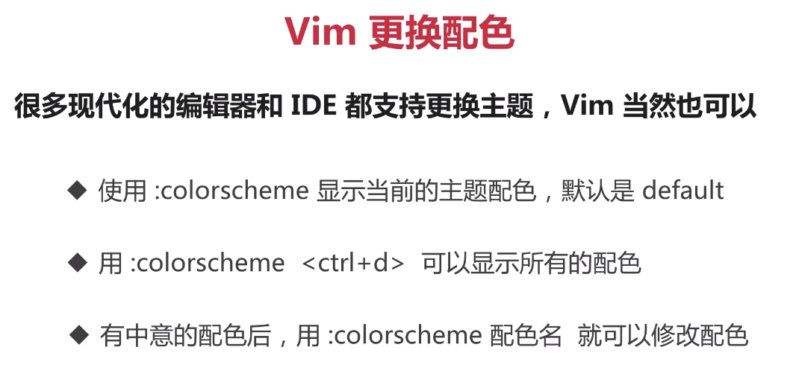


【课程 2-13】

### 裸的 Vim 也很强

学习 Vim 之前，先对打字指法和盲打很熟悉

- 编辑代码，脑子一般比手快，盲打有利于跟上你的大脑速度
- 裸的 Vim 也有很多强大的功能和使用方式
- 学会了 Vim ，你可以再 IDE 上安装 Vim 插件，几乎所有流行的编辑器和 IDE 工具都支持 Vim 插件

通过以上学习，下一步，我们该学习：

- 之后，我们来学习 Vim 配置，我的 Vim 我做主
- Vim 也在与时俱进，一起探索 Vim 各种炫酷和方便的插件
- 用中学，学中用，慢慢形成肌肉记忆


## 03-编写 Vim 配置，我的 Vim 我做主

【课程 3-1】

### 编写 Vim 配置，我的 Vim 我做主

如何编写自己的 Vim 配置文件：

- Linux / Unix 下建立一个隐藏文件：`vim ~/.vimrc`
- windows 系统 `vim $MYVIMRC` ，通过环境变量编辑配置文件
- 接着，我们可以开始自定义自己的配置了

Vim 配置都包含了什么？

可以开始编辑 Vim 配置文件了，但是需要配置什么呢？

- 常用设置，比如： `set nu` 设置行号，colorscheme hybrid 设置主题
- 常用的 Vim 映射，比如 `noremap < leader >w:w<cr> `保存文件
- 自定义 vimscript 函数（Vim 高手）和插件配置（详情见插件篇）

首先，是常用的 Vim 配置

- 我们可以把常用的设置写到 `.vimrc` 里避免每次打开 vim 重新设置
- 比如设置行号 `set nu` ，设置主题 `colorsheme hybrid`
- Vim 里有非常多的这种配置，此时需要参考别人的配置

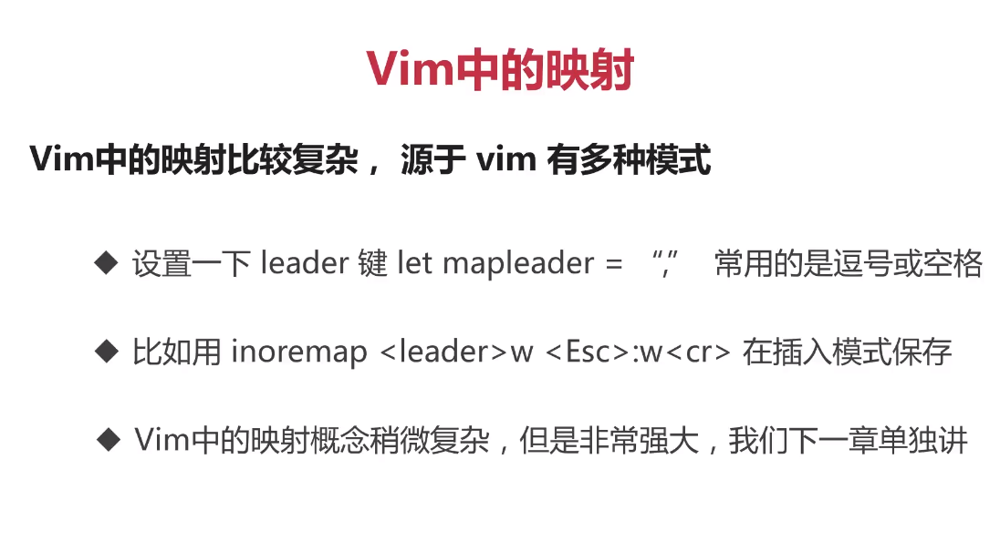


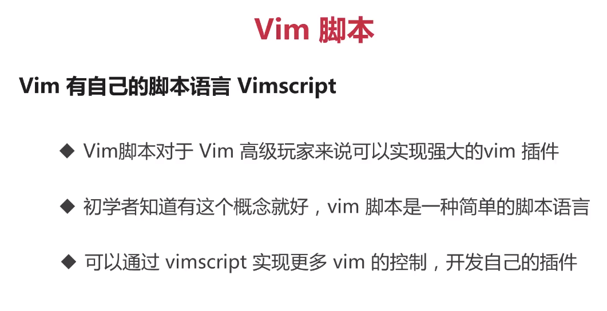


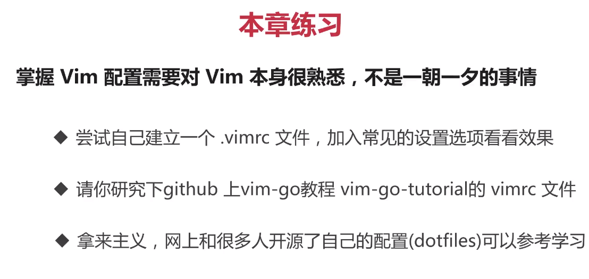


【课程 3-2】

### Vim 映射迷人眼（未完成，笔记没写完）

> 映射可以让你的 Vim 按照你想要的的方式工作。

基本映射指的是 normal 模式下的映射，当然还有其他模式下的映射

- 使用 map 就可以实现映射。比如 `:map - x` 设置后，按下 - 就会删除字符

- `:map <space> viw` 告诉 vim 按下空格的时候选中整个单词

- `:map <c-d> dd` 可以使用 ctrl + d 执行 dd 删除一行


推荐学习资料：[VimScript 小书](http://learnvimscriptthehardway.onefloweroneworld.com/preface.html)

### 配置 Vim，让它更顺手


## 04-Vim 安装和使用插件

### 安装插件，竟如此简单

使用 Vim-Plug 安装插件

> 学习新东西的最好的方式就是看官方文档示例

- 官网：[Vim-plug](https://github.com/junegunn/vim-plug)

拷贝以下代码：

```bash
" - Avoid using standard Vim directory names like 'plugin'
call plug#begin('~/.vim/plugged')

"  插件放在这里

" Initialize plugin system
call plug#end()
```

安装第一个插件：**vim-startify**

- [vim-startify](https://github.com/mhinz/vim-startify)
- 安装：
  - 修改 .vimrc 文件，增加该插件名称
  - 重新启动 Vim 或者 source .vimrc 保存，执行 `:PlugInstall`
  - 安装完成后，退出 vim 再进入 vim ，就可以看到效果啦。(如果遇到报错，重新安装 vim：`sudo apt-get install vim`)

.vimrc 代码如下：

```bash
" - Avoid using standard Vim directory names like 'plugin'
call plug#begin('~/.vim/plugged')

Plug 'mhinz/vim-startify'

" Initialize plugin system
call plug#end()
```


### 如何寻找到自己想要的插件

推荐网站：[VimAwesome](https://vimawesome.com/)

方法：

- Google 关键词 寻找到想要的插件
- [VimAwesome](https://vimawesome.com/)
- 浏览网上开源 Vim 配置借鉴想要的插件

常用：

nerdtree：[github-nerdtree](https://github.com/scrooloose/nerdtree)


### Vim美化插件：让你的 vim 与众不同

- 修改启动界面：https://github.com/mhinz/vim-startify
- 状态栏美化：https://github.com/vim-airline/vim-airline
- 增加代码缩进线条：https://github.com/Yggdroot/indentLine

bash 代码：

```bash
" - Avoid using standard Vim directory names like 'plugin'
call plug#begin('~/.vim/plugged')

Plug 'mhinz/vim-startify'
Plug 'vim-airline/vim-airline'
Plug 'vim-airline/vim-airline-themes'
Plug 'Yggdroot/indentLine'

" Initialize plugin system
call plug#end()
```


Vim 配色方案：

常用方案：

- vim-hybrid ：https://github.com/w0ng/vim-hybrid
- solarized ： https://github.com/altercation/solarized
- gruvbox ： https://github.com/morhetz/gruvbox

我们选择 hybrid

bash 代码：

```bash
" - Avoid using standard Vim directory names like 'plugin'
call plug#begin('~/.vim/plugged')

Plug 'mhinz/vim-startify'
Plug 'vim-airline/vim-airline'
Plug 'vim-airline/vim-airline-themes'
Plug 'Yggdroot/indentLine'
Plug 'w0ng/vim-hybrid'

" Initialize plugin system
call plug#end()
```

更换主题：`colorscheme hybrid` 然后按回车

这个时候，我们就可以看到配色发生变化了


### Vim 文件和目录搜索插件，跳转文件 so easy

- nerdtree： https://github.com/scrooloose/nerdtree

安装成功以后，我们再次打开 vim 时，发现没有什么变化，我们回到文档，看看还需要做什么配置

- 在启动 vim 时打开 nerdTree：在 vimrc 中配置下面这句，但是不推荐，因为每次我们编辑代码的时候，我们都希望保留屏幕最大化。因此，我们希望的是使用快捷键唤醒 nerdtree。

```bash
autocmd vimenter * NERDTree
```

- 快捷键设置：

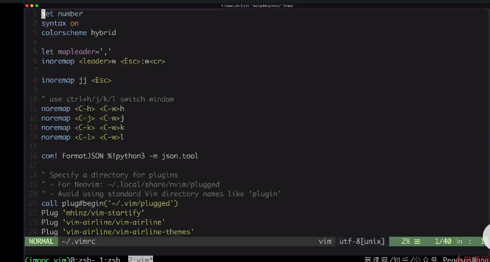

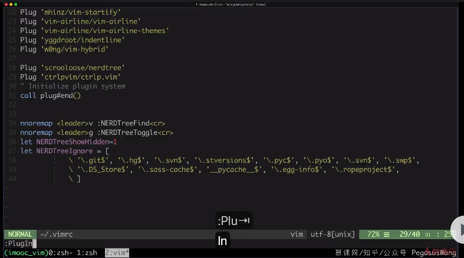

上面图片中配置代码：

```bash
set number
syntax on
colorscheme hybrid
let mapleader = ','
inoremap <leader>w <Esc>:w<cr>

inoremap jj <Esc>

" use ctrl + h/j/k/l switch window
noremap <C-h> <C-w>h
noremap <C-j> <C-w>j
noremap <C-k> <C-w>k
noremap <C-l> <C-w>l

com! FormatJSON $!python3 -m json.tool

call plug#begin('~/.vim/plugged')

Plug 'mhinz/vim-startify'
Plug 'vim-airline/vim-airline'
Plug 'vim-airline/vim-airline-themes'
Plug 'Yggdroot/indentLine'
Plug 'w0ng/vim-hybrid'
Plug 'scrooloose/nerdtree'
Plug 'ctrlpvim/ctrlp.vim'

" Initialize plugin system
call plug#end()

nnoremap <leader>v :NERDTreeFind<cr>
nnoremap <leader>g :NERDTreeToggle<cr>
let NERDTreeShowHidden=1
let NERDTreeIgnore=['\.git$','\.hg$','\.svn$'...]
```


- 模糊搜索器：打开目录后，我们依然是需要一层一层打开文件夹才能找到目标文件。此时，我们可以使用工具 ctrlp

  - [ctrlp.vim](https://github.com/kien/ctrlp.vim)
  - 自定义快捷键，方便跳转文件

  ```bash
  let g:ctrlp_map = '<c-p>'
  let g:ctrlp_cmd = 'CtrlP'
  ```

  - 分屏，窗口切换快捷键


bash 代码：

```bash
" - Avoid using standard Vim directory names like 'plugin'
call plug#begin('~/.vim/plugged')

Plug 'mhinz/vim-startify'
Plug 'vim-airline/vim-airline'
Plug 'vim-airline/vim-airline-themes'
Plug 'Yggdroot/indentLine'
Plug 'w0ng/vim-hybrid'
Plug 'scrooloose/nerdtree'
Plug 'ctrlpvim/ctrlp.vim'

" Initialize plugin system
call plug#end()
let g:ctrlp_map = '<c-p>'
```


### Vim快速定位插件，文件位置任我行

回顾：

- 使用 w / e 基于单词移动，gg / G 文件收尾，0 / $ 行首尾，f {char} 查询字符
- Ctrl + f ， Ctrl + u 前后翻屏
- 那我想跳转到**窗口显示区**的任意位置呢？

使用 [Easymotion](https://github.com/easymotion/vim-easymotion)

使用递归映射：记住下面的快捷键即可

```bash
nmap ss <Plug>(easymotion-s2)
```


bash 代码：

```bash
" - Avoid using standard Vim directory names like 'plugin'
call plug#begin('~/.vim/plugged')

Plug 'mhinz/vim-startify'
Plug 'vim-airline/vim-airline'
Plug 'vim-airline/vim-airline-themes'
Plug 'Yggdroot/indentLine'
Plug 'w0ng/vim-hybrid'
Plug 'scrooloose/nerdtree'
Plug 'ctrlpvim/ctrlp.vim'

Plug 'easymotion/vim-easymotion'

" Initialize plugin system
call plug#end()
let g:ctrlp_map = '<c-p>'
nmap ss <Plug>(easymotion-s2)
```


### Vim-suuround，编辑也要成双成对

如果快速让你更换一对单引号为双引号，你会怎么做？

- [Vim-suround](https://github.com/tpope/vim-surround) 
- 使用，记住以下快捷键：

```bash
- ds (delete a surrounding)
- cs (change a surrounding)
- ys (you add surrounding)
```

- 具体操作

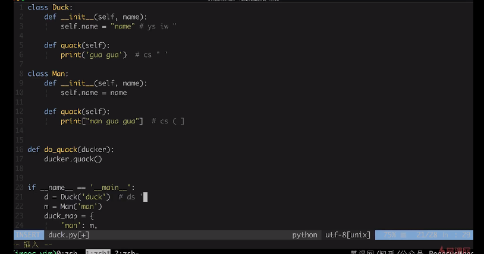

bash 配置

```bash

" - Avoid using standard Vim directory names like 'plugin'
call plug#begin('~/.vim/plugged')

Plug 'mhinz/vim-startify'
Plug 'vim-airline/vim-airline'
Plug 'vim-airline/vim-airline-themes'
Plug 'Yggdroot/indentLine'
Plug 'w0ng/vim-hybrid'
Plug 'scrooloose/nerdtree'
Plug 'ctrlpvim/ctrlp.vim'
Plug 'easymotion/vim-easymotion'

Plug 'tpope/vim-surround'

" Initialize plugin system
call plug#end()
let g:ctrlp_map = '<c-p>'
nmap ss <Plug>(easymotion-s2)
```


### 强大的 vim 模糊搜索与替换插件

fzf 与 fzf.vim

- 官网：[fzf.vim](https://github.com/junegunn/fzf.vim) 
- 安装：

```bash
Plug 'junegunn/fzf', { 'dir': '~/.fzf', 'do': './install --all' }
Plug 'junegunn/fzf.vim'
```

基本使用：

- 使用 Ag [PATTERN] 模糊搜索字符串
- 使用 Files [PATH] 模糊搜索目录
- 更多用法参考 [fzf.vim](https://github.com/junegunn/fzf.vim) 中的 Command 部分

如果想要实现 **批量搜索替换** ，可以使用插件 [far.vim](https://github.com/brooth/far.vim)

- 安装：

```bash
Plug 'brooth/far.vim'
```

- 基本使用：

```bash
:Far foo bar **/*.py  # 表示将字母 foo 换成 bar，**/*.py 表示需要替换的文件（范围）
:Fardo  # 确认执行
```

具体使用参考：[usage](https://github.com/brooth/far.vim)


### 愉快写 golang 之 vim-go 插件

- github 地址：[vim-go](https://github.com/fatih/vim-go)
- 具有 代码补全，重构，跳转，自动格式化，自动导入等功能
- 基本可以满足 golang 的日常开发
- 插件安装：`Plug 'fatih/vim-go', { 'do': ':GoUpdateBinaries' }`
- 使用： [Usage](https://github.com/fatih/vim-go/wiki) ，可以参考官网（使用说明比较少，可参考相关资料）

常用快捷键：

```bash
Ctrl + x o 代码提示
Ctrl + i
Ctrl + o
```


### python-mode 把 vim 打造成轻量 Python-IDE

Python 插件使用较多的是

- [jedi-vim](https://github.com/davidhalter/jedi-vim)  自动补全
- [python-mode](https://github.com/python-mode/python-mode) a Python IDE for Vim，具备补全，跳转，调试，重构，格式化等功能
- 有了上面，即使在服务器也可以愉快的调试代码了

Python-mode 安装相关：

- 前提：Vim >= 7.3 ，如何判断？ `vim --version`
- 安装：

```bash
Plug 'python-mode/python-mode', { 'for': 'python', 'branch': 'develop' }
```

安装完成以后，添加如下配置：

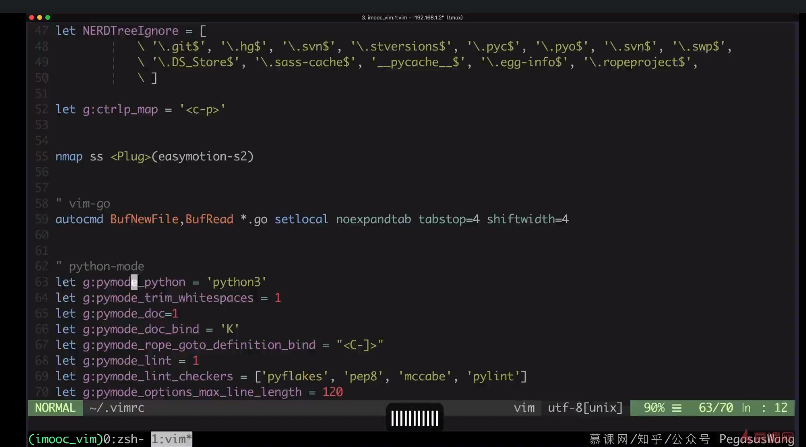

jedi-vim 安装相关

安装： `Plugin 'davidhalter/jedi-vim'`

配置和使用：[Usage](https://github.com/davidhalter/jedi-vim)


### vim tagbar 更愉快地浏览代码

- 官网：[vim-tagbar](https://github.com/majutsushi/tagbar)
- 需要安装 Universal Ctags 生成对应的 Ctags文件：[ctags](http://docs.ctags.io/en/latest/) 
- vim tagbar 安装

```bash
Plug 'majutsushi/tagbar'
```

- 使用：使用 vim 打开文件后，输入 `:TagbarToggle` 即可触发，我们可以对其定义快捷键映射

```bash
nnoremap <leader>t TagbarToggle<CR>
```

- 高亮你感兴趣的单词，使用插件：[vim-interestingwords](https://github.com/lfv89/vim-interestingwords)

- 安装：

```bash
Plug 'lfv89/vim-interestingwords'
```

- 使用方式：

```js
- Highlight with <Leader>k  //使用快捷键 leader + k
- Navigate highlighted words with n and N  //跳转到下一个高亮的单词
- Clear every word highlight with <Leader>K throughout the buffer  //大 K 清除
```

### 强大的 Vim 补全插件

>  使用前提：**Note:** deoplete requires Neovim (0.3.0+ and of course, **latest** is recommended) or Vim8 with Python3.6.1+ and timers enabled. 

特点：异步补全

- 官网：[vim-deoplete](https://github.com/Shougo/deoplete.nvim)
- 安装

```bash
if has('nvim')
  Plug 'Shougo/deoplete.nvim', { 'do': ':UpdateRemotePlugins' }
else
  Plug 'Shougo/deoplete.nvim'
  Plug 'roxma/nvim-yarp'
  Plug 'roxma/vim-hug-neovim-rpc'
endif
let g:deoplete#enable_at_startup = 1  " 这句话建议放在最后
```

说明：使用该插件后会出现预览窗口，而且不方便关闭。为了解决该问题，需要将下面的代码，放在最后

```bash
let g:deoplete#enable_at_startup = 1  " 这句话建议放在最后
```

其他插件推荐：

- [deoplete-go](https://github.com/deoplete-plugins/deoplete-go)
- 安装：

```bash
Plug 'Shougo/deoplete.nvim'
Plug 'deoplete-plugins/deoplete-go', { 'do': 'make'}
```

- 使用：看文档 [deoplete-go](https://github.com/deoplete-plugins/deoplete-go)

其他插件推荐：

- [neoclide/coc-vim](https://github.com/neoclide/coc.nvim) 一个强大的 neovim / vim8 补全插件，LSP支持 （国产，前端大神开发的）
- 特点：快速，可靠
- 安装方式：

```bash
" 以下方式三选一

" Use release branch
Plug 'neoclide/coc.nvim', {'branch': 'release'}

" Or latest tag
Plug 'neoclide/coc.nvim', {'tag': '*', 'branch': 'release'}

" Or build from source code by use yarn: https://yarnpkg.com
Plug 'neoclide/coc.nvim', {'do': 'yarn install --frozen-lockfile'}

" 还可以根据不同的语言选择不同的补全配置，详情看官网 Extensions 部分

```

- 自定义配置： 参考官网的 Examples


当前 bash 配置：

```bash

set number

" - Avoid using standard Vim directory names like 'plugin'
call plug#begin('~/.vim/plugged')

Plug 'mhinz/vim-startify'
Plug 'vim-airline/vim-airline'
Plug 'vim-airline/vim-airline-themes'
Plug 'Yggdroot/indentLine'
Plug 'w0ng/vim-hybrid'
Plug 'scrooloose/nerdtree' 
Plug 'ctrlpvim/ctrlp.vim'
Plug 'easymotion/vim-easymotion'
Plug 'tpope/vim-surround'
Plug 'junegunn/fzf', { 'dir': '~/.fzf', 'do': './install --all' }
Plug 'junegunn/fzf.vim'
Plug 'fatih/vim-go', { 'do': ':GoUpdateBinaries' }
Plug 'python-mode/python-mode', { 'for': 'python', 'branch': 'develop' }
Plug 'majutsushi/tagbar'
Plug 'lfv89/vim-interestingwords'
Plug 'davidhalter/jedi-vim'

if has('nvim')
  Plug 'Shougo/deoplete.nvim', { 'do': ':UpdateRemotePlugins' }
else
  Plug 'Shougo/deoplete.nvim'
  Plug 'roxma/nvim-yarp'
  Plug 'roxma/vim-hug-neovim-rpc'
endif
Plug 'Shougo/deoplete.nvim'
Plug 'deoplete-plugins/deoplete-go', { 'do': 'make'}
Plug 'neoclide/coc.nvim', {'branch': 'release'}


" Initialize plugin system
call plug#end()

let g:ctrlp_map = '<c-p>'
nmap ss <Plug>(easymotion-s2)
let g:deoplete#enable_at_startup = 1  " 这句话建议放在最后
```


### Vim 代码格式化和静态检查

> vim-autoformat 和 Neoformat 是两种使用较多的格式化插件，这里我们选择 Neoformat

目标：

- 把精力集中在代码逻辑本身，而不是整理格式这些浪费精力的事情上
- 静态检查是为了让代码编写更加规范。如 golint /  pylint / eslint 等
- 无论你编写何种编程语言，最好都加上自动格式化静态检查

插件工具：

- [vim-neoformat](https://github.com/sbdchd/neoformat)
- 安装：

```bash
Plug 'sbdchd/neoformat'
```

安装完成后，如果需要格式化 python，需要安装对应语言的格式化库：python autopep8 / js 的prettier等

```bash
" python的格式化库
pip install autopep8

" js 的格式化库
npm install prettier

" ... 其他格式化库可以看 官方文档 自行配置和安装
```

静态检查 Lint

neomake 和  ale 是两种常见的 lint 插件，这里我们选用 ale

- 插件官网：
  - [ale-github](https://github.com/w0rp/ale)
  - [neomake](https://github.com/neomake/neomake)
- 同样，我们需要安装对应的语言的 lint 库。比如 eslint / pylint / golint 等
- vim 8 和 neovim 支持异步检查，不会影响 vim 编辑，推荐使用。
- 安装：

```bash
" 以下二选一
Plug 'w0rp/ale'

Plug 'neomake/neomake'
```

- **这里我们选择 ale**
- 安装对应语言的 lint 库

```bash
pip install pylint
```

由于 pylint 插件对代码检查非常严格，我们需要对其设置，从而忽略一些不重要的代码检查规则。

```bash
" 定义一个名为 .pylintrc 文件放在根目录下，在里面配置需要忽略的选项
" 使用方法——参考 官方文档
```


### vim 快速注释代码

> vim 注释插件有很多，这里我们选择一个轻量的 vim-commentary

- 插件官网： [vim-commentary](https://github.com/tpope/vim-commentary)
- 安装：

```bash
Plug 'tpope/vim-commentary'
```

- 使用：
  - 记住常用的命令 gc 注释和取消注释
  - 插件会根据不同的文件类型使用不同注释。python(#)， golang(//)


### vim 和 git ，强强联手

> 在 vim 里，使用 git，使用 git 包装器 fugitive

- 插件官网：[vim-fugitive](https://github.com/tpope/vim-fugitive)
- 安装：

```bash
Plug 'tpope/vim-fugitive'
```

- 使用：
  - 常用命令 Gedit, Gdiff ,Gblame ,Gcommit等（更多使用推荐看官网），但是不推荐如此使用。
  - 笔者还是喜欢用 Tmux 新开一个窗口来使用 git，后面会讲到

其他插件：

- 插件官网： [git-gutter](https://github.com/jisaacks/GitGutter) ，在 vim 里显示文件变动
- 作用：当我们修改文件后，可以显示当前文件夹的变动。那些内容是新增的，删除的，修改的等。
- 安装：

```bash
Plug 'jisaacks/GitGutter'
```

- 使用：参考官方文档

其他插件：

- [gv.vim](https://github.com/junegunn/gv.vim) ,在命令行查看 git 提交记录
- 安装：

```bash
Plug 'tpope/vim-fugitive'   " 这一插件我们前面已经安装，可不安装

Plug 'junegunn/gv.vim'
```

- 使用：使用 `:GV` 来调用

### 本章小结

- vim 插件很多，不可能全部介绍，需要学会自己寻找安装
- 通过 google 或者是 vimawesome 参考开源配置寻找插件
- 学会阅读插件的 README 文件和 doc 里的帮助文件学习插件的使用

最后，缺少什么插件，就去寻找什么插件吧~


## 05-与时俱进的 Vim

### vim 与 Tmux ，天作之合

Tmux，是一个强大的终端复用工具，通过 brew(mac) apt-get install(ubuntu) 进行安装

作用：

- 可以复用终端，分屏，托管进程等
- 在服务器上即使退出服务器也不会被 kill，托管进程也很方便
- 可以方便的分割屏幕，实现多个进程公用屏幕

课前资料：详细阅读：[手把手教你使用终端复用神器 Tmux，丢掉鼠标不是梦-知乎](https://zhuanlan.zhihu.com/p/43687973)

安装：`sudo apt-get install tmux`

基本使用：请看 [视频](https://www.imooc.com/video/19480) 

- 分割屏幕： `ctrl + b %`
- 尝试一个窗口编写代码，一个窗口使用 shell 命令
- 尝试退出和重新 attach 到一个 tmux 的会话

### 无处不在的vim，让vim嵌入你的开发工具

几乎所有的 IDE 都支持 vim 插件，甚至 chrome 都支持 vim 插件

- 即使你不用 vim 作为主力编辑器，依然可以使用它的编辑方式
- 几乎流行的开发工具都支持vim插件，以vim 的方式编辑
- 比如 vscode、pycharm、Atom 都支持 vim 插件


### 与时俱进的 vim 之 neovim 

官网：[neovim](https://neovim.io/)

特点：

- 开发更加活跃，更丰富的特性和拓展，异步支持
- neovim 的设计可以嵌入到很多的 GUI 里，加上好看的【外壳】

文档和使用：[github-neovim](https://github.com/neovim/neovim)

### 站在巨人的肩膀上，使用强大的开源配置

如果你已经熟悉了 vim 的配置，可以从网上直接使用一些开源的配置

推荐配置：

- [SpaceVim-github](https://github.com/SpaceVim/SpaceVim) 含有中文教程，比较友好
- [本视频作者](https://github.com/PegasusWang/vim-config)

对新手而言，不推荐其他复杂的vim 配置，上手太难。


## 总结：vim 虐我千百遍，我待 vim 如初恋

（完）

以下，是所有 bash 配置：

```bash

set number

" - Avoid using standard Vim directory names like 'plugin'
call plug#begin('~/.vim/plugged')

Plug 'mhinz/vim-startify'
Plug 'vim-airline/vim-airline'
Plug 'vim-airline/vim-airline-themes'
Plug 'Yggdroot/indentLine'
Plug 'w0ng/vim-hybrid'
Plug 'scrooloose/nerdtree' 
Plug 'ctrlpvim/ctrlp.vim'
Plug 'easymotion/vim-easymotion'
Plug 'tpope/vim-surround'
Plug 'junegunn/fzf', { 'dir': '~/.fzf', 'do': './install --all' }
Plug 'junegunn/fzf.vim'
Plug 'fatih/vim-go', { 'do': ':GoUpdateBinaries' }
Plug 'python-mode/python-mode', { 'for': 'python', 'branch': 'develop' }
Plug 'majutsushi/tagbar'
Plug 'lfv89/vim-interestingwords'
Plug 'davidhalter/jedi-vim'

if has('nvim')
  Plug 'Shougo/deoplete.nvim', { 'do': ':UpdateRemotePlugins' }
else
  Plug 'Shougo/deoplete.nvim'
  Plug 'roxma/nvim-yarp'
  Plug 'roxma/vim-hug-neovim-rpc'
endif
Plug 'Shougo/deoplete.nvim'
Plug 'deoplete-plugins/deoplete-go', { 'do': 'make'}
Plug 'neoclide/coc.nvim', {'branch': 'release'}

Plug 'sbdchd/neoformat'
Plug 'w0rp/ale'
Plug 'tpope/vim-commentary'
Plug 'tpope/vim-fugitive'
Plug 'jisaacks/GitGutter'
Plug 'junegunn/gv.vim'


" Initialize plugin system
call plug#end()

let g:ctrlp_map = '<c-p>'
nmap ss <Plug>(easymotion-s2)
let g:deoplete#enable_at_startup = 1  " 这句话建议放在最后
```

