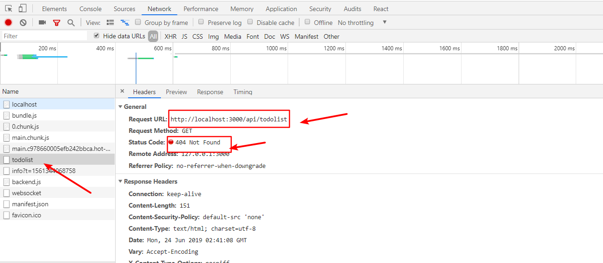
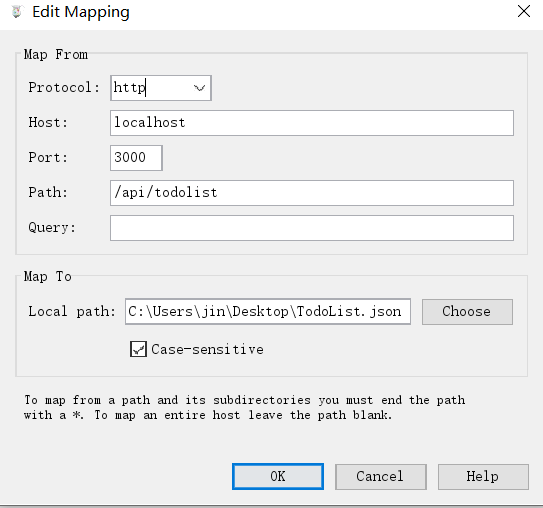
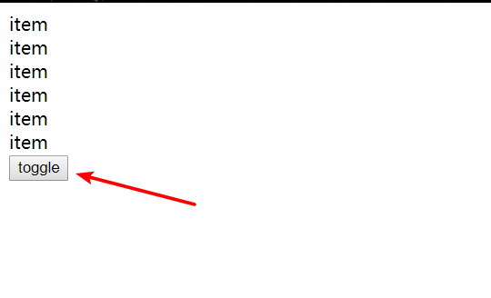

## 在 React 发送 Ajax 请求

错误思想：我们可能会想，数据请求在 render 渲染的时候加载合适，所以 Ajax 请求放在 render 函数中

错误代码：

```jsx
 render() {
 	    let result = {};
 	    this.ajax.then((res) =>{
 	    	result = res
 	    });
        const {content} = this.props;
        return (
            <div onClick={this.handleClick}>{content}</div>
            {result}
        )
    }
```

我们来分析 【为什么不能这么写？】

因为 render 函数会被反复执行，导致 Ajax 会重复请求。

而通常而言，Ajax 只需要获取一次就行了！

这个时候，我们会想到 【只会被执行一次的生命周期函数】

—— `componentDidMount`  和 `componentWillMount` 或者是 放在构造函数 `constructor` 中

但是，如果使用 `componentWillMount` ，考虑到后面项目开发逐渐复杂，比如写 `react native` 或者服务器端的同构时，会和一些更高端的技术产生冲突

同时，也不建议获取 Ajax 请求写在 `constructor` 中

推荐写法：写在 `componentDidMount` 中，不会有任何问题！

比如，我们使用 `axios` 进行测试：

-  `yarn add axios`
- [yarn 安装失败：No sucn file: add](https://stackoverflow.com/questions/46013544/yarn-install-command-error-no-such-file-or-directory-install/48010859)

然后，看详细代码：

```jsx
import React, { Component, Fragment} from 'react';
import TodoItem from './TodoItem';
import axios from 'axios';
import './style.css'

class TodoList extends Component{

    constructor(props){
        super(props);
        this.state = {
            inputValue: '',
            list: ['学习英文', '学习 React']
        };
       {//略...}
    }

    render(){
        return (
           {//省略部分代码...}
        )
    }
            
    componentDidMount() {
        axios.get('/api/todolist').then(() =>{
            alert('succ');
        }).catch(() => {
            alert('error');
        });
    }
}

export default TodoList;
```

效果如下：




## 使用 Charles 实现本地数据 mock

- [Charles 下载安装](https://www.axihe.com/charles/charles/download.html#windows-64)
- [Charles 注册码](https://www.axihe.com/charles/charles/free-use.html#charles-%E7%A0%B4%E8%A7%A3%E5%8E%9F%E7%90%86%E4%BA%8C-%E6%B3%A8%E5%86%8C%E7%A0%81%E8%BF%9B%E8%A1%8C%E6%B3%A8%E5%86%8C)

首先，新建 `Todolist.json` 文件，在里面写点东西：

```json
["Dell", "Lee", "Hello"]
```

然后，打开 Tools >> Map Local >> Add ，根据刚才 axios 中使用的路径来配置：




相关代码：

```jsx
import React, { Component, Fragment} from 'react';
import TodoItem from './TodoItem';
import axios from 'axios';

{// 省略部分代码}

componentDidMount() {
        axios.get('/api/todolist').then((res) =>{
            console.log(res);
            this.setState(() => {
               list: [...res.data]
            })
        }).catch(() => {alert('error')});
    }
    
    {// 省略部分代码}
```


## React 实现 CSS 过渡动画

 看代码：

```jsx
import React, { Component, Fragment } from 'react';
import './style.css';

class App extends Component {
    constructor(props) {
        super(props);
        this.state = {
            show: true
        };
        this.handleToggle = this.handleToggle.bind(this);
    }
    render() {
        return (
            <Fragment>
                <div className={this.state.show ? 'show' : 'hide'}>hello</div>
                <button onClick={this.handleToggle}>toggle</button>
            </Fragment>
        )
    }
    handleToggle() {
        this.setState({
            show: this.state.show ? false : true
        })
    }
}

export default App;
```

对应的 css 如下：

```css
.show {
    opacity: 1;
    transition: all 1s ease-in;
}

.hide {
    opacity: 0;
    transition: all 1s ease-in;
}
```


## React 中使用 CSS 的动画效果

js 代码还是和上面一样，修改 css 代码即可

```css
.show {
    opacity: 1;
    transition: all 1s ease-in;
}

.hide {
    opacity: 0;
    animation:hide-item 2s ease-in;
}

@keyframes hide-item {
	0%{
 		opacity: 1;
 		color: red;
	 }
	 50%{
	 	opacity: 0.5;
	 	color: green;
	 }
	 100%{
         opacity: 0;
         color: blue;
	 }
}
```

这样就实现了动画效果啦

但是还有一个问题，动画效果结束后它又显示了！？

我们想要的是让 item 隐藏，**即保留该动画最后一帧的样式**，难道需要单独写一个 css 样式吗？

不需要，直接使用 `forwards` 即可实现，代码如下：

```css
.hide {
    opacity: 0;
    animation:hide-item 2s ease-in forwards;
}
```


## React-transition-group 的使用

>  [React-transition-group安装](https://reactcommunity.org/react-transition-group/)

### CSSTransition 的使用

- [CSSTransition学习教程](https://reactcommunity.org/react-transition-group/css-transition)

代码如下：

```jsx
import React, { Component, Fragment } from 'react';
import { CSSTransition } from 'react-transition-group';
import './style.css';

class App extends Component {
    constructor(props) {
        super(props);
        this.state = {
            show: true
        };
        this.handleToggle = this.handleToggle.bind(this);
    }
    render() {
        return (
            <Fragment>
                <CSSTransition
                    in={this.state.show}
                    timeout={1000}
                    classNames='fades'
                    unmountOnExit
                    onEnter={(el) => {el.style.color='blue'}}
                >
                    <div className={this.state.show ? 'show' : 'hide'}>hello</div>
                </CSSTransition>
                <button onClick={this.handleToggle}>toggle</button>
            </Fragment>
        )
    }
    handleToggle() {
        this.setState({
            show: this.state.show ? false : true
        })
    }
}

export default App;
```

CSS 代码为：

```css
.fade-enter, .fade-appear{ //动画进入前效果
    opacity: 0;
}
.fade-enter-active, .fade-appear-active{ //动画进入时效果
    opacity: 1;
    transition: opacity 1s ease-in;
}
.fade-enter-done{ //动画进入后效果
    opacity: 1;
}

.fade-exit{ //动画退出前效果
    opacity: 1;
}
.fade-exit-active { //动画退出时效果
    opacity: 0;
    transition: opacity 1s ease-in;
}
.fade-exit-done {  //动画退出后效果
    opacity: 0;
}

```


其中，需要着重说明：

```jsx
 <CSSTransition
     in={this.state.show}
     timeout={1000}
     classNames='fades'
     unmountOnExit
     onEnter={(el) => {el.style.color='blue'}}
     appear={true}
     >
	 <div className={this.state.show ? 'show' : 'hide'}>hello</div>
 </CSSTransition>
```

- `unmountOnExit` 表示在 toggle 以后，显示后逐渐隐藏的 div 在完成过渡效果后**消失** 
- `onEnter` 钩子。即在有需要时或者说仅仅使用 css 过渡实现不了过渡效果时，辅助 js 的方式添加过渡效果，上述代码中使用 js 的方式给过渡元素添加颜色为蓝色。当然， CSS Transition还提供了其他钩子，如 `onEntering` ，`onEntered` ， `onExit` 等，我们需要特别注意这些**钩子的执行时间**。
- `className="fade"` 当 class 名字设置成什么，对应的 CSS 样式就是 `.fade-enter` 或 `.fade-exit` 等，名字需要一一对应！
- `appear={true}` 属性，即当你想要**页面一开始加载的时候就有该动画效果**，设置该属性为 true ，同时在 CSS 代码中添加 `.fade-appear` 等即可实现。

**需要注意：**当使用 `CSSTransition` 满足不了我们的动画需求时，我们可以看看 [transition](http://reactcommunity.org/react-transition-group/transition) ，这里可以找到对应的方法


### TransitionGroup 的使用

- [transition-group 教程](http://reactcommunity.org/react-transition-group/transition-group)

应用场景：当多个 DOM 需要做同样的动画时使用。

需求：点击按钮新增同样的 item ，同时，每一个新增的 item 都有同样的动画效果。

JS 代码如下：

```jsx
import React, { Component, Fragment } from 'react';
import { CSSTransition } from 'react-transition-group';
import './style.css';

class App extends Component {
    constructor(props) {
        super(props);
        this.state = {
            list: []
        };
        this.addItem = this.addItem.bind(this);
    }
    render() {
        return (
            <Fragment>
                {
                    this.state.list.map( (item, index) => {
                        return (<div key={index}>{item}</div>)
                    })
                }
                <button onClick={this.addItem}>toggle</button>
            </Fragment>
        )
    }
    addItem() {
        this.setState((prevState) => {
            return {
                list: [...prevState.list, 'item']
            }
        })
    }
}
```

效果如下：



需求：每次点击按钮新增 item 都会有同样的动画效果

```jsx
import React, { Component, Fragment } from 'react';
import { CSSTransition, TransitionGroup } from 'react-transition-group';
import './style.css';


class App extends Component {
    constructor(props) {
        super(props);
        this.state = {
            list: []
        };
        this.addItem = this.addItem.bind(this);
    }
    render() {
        return (
                <Fragment>
                    <TransitionGroup>
                        {
                            this.state.list.map( (item, index) => {
                                return (
                                    <CSSTransition
                                        timeout={1000}
                                        classNames="fade"
                                        unmountOnExit
                                        onEntered={(el) => {el.style.color='blue'}}
                                        key={index}
                                        appear={true}
                                    >
                                        <div>{item}</div>
                                    </CSSTransition>
                                )
                            })
                        }
                        <button onClick={this.addItem}>toggle</button>
                    </TransitionGroup>
                </Fragment>
        )
    }
    addItem() {
        this.setState((prevState) => {
            return {
                list: [...prevState.list, 'item']
            }
        })
        console.log(this.state.list);
    }
}

export default App;
```

对于原来 `CSSTransition` 里面的属性，只需要将 `in={this.state.show}` 删除即可，其他不需要改变

将需要做动画效果的单个组件包裹在 `CSSTransition` 里面，然后在其外侧包裹 `TransitionGroup` 就可以实现啦。

**注意：对于 `key={index}` 需要放在第一个外层元素上** ，而不是原来的 `<div key={index}>{item}</div>` 上


### 小结：

在日常开发中，通常需要将 `CSSTransition` 和 `TransitionGroup` 结合使用，当我们发现使用 `TransitionGroup` 无法满足需求时，我们可以看看 `CSSTransition` 的API，通常可以找到我们想要的答案。