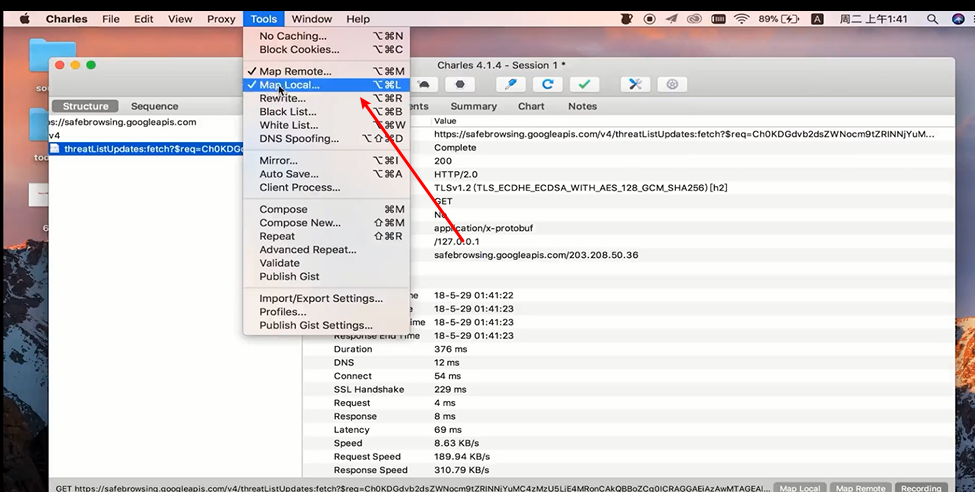
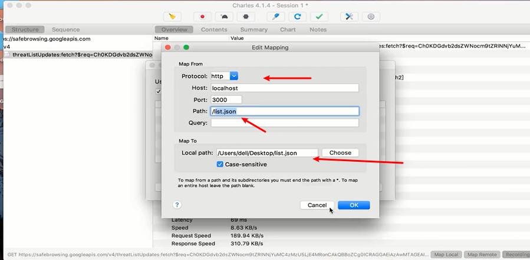
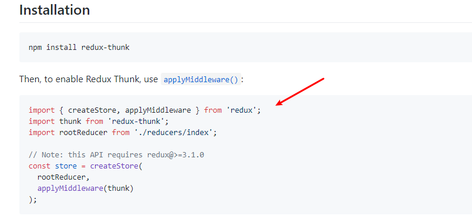
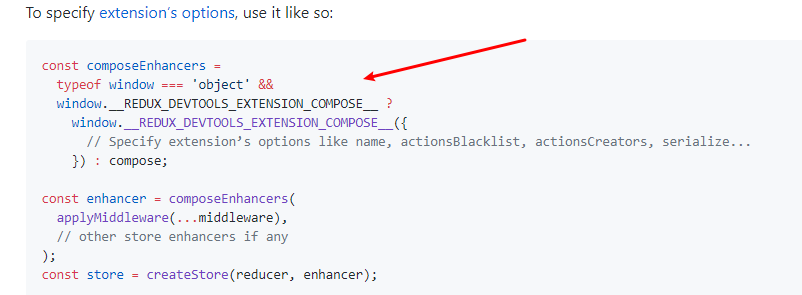
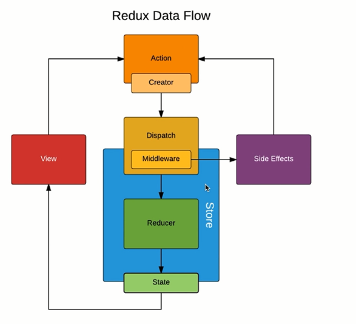
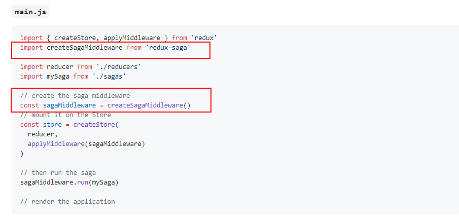
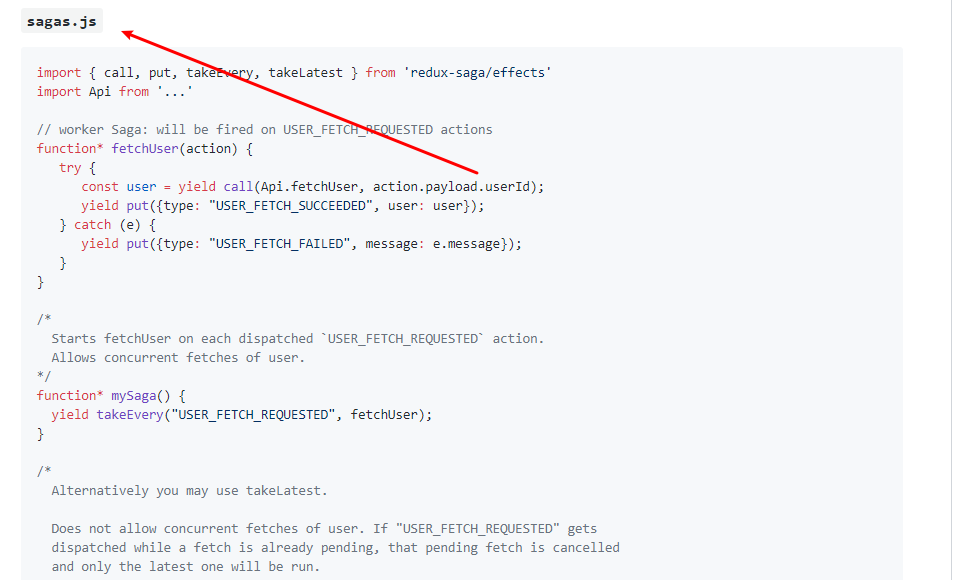

# React 入门04—Redux 高级

## UI组件和容器组件

> 前面我们所写的 `MyTodo.js` 文件中，我们将样式的代码和逻辑代码写在了同一个文件中，不利于代码的维护。

- UI 组件：负责组件的样式
- 容器组件： 负责组件的逻辑

原来的代码：

```jsx
// ...
class TodoList extends Component{

    constructor(props){
         //...
    }

    render(){
        return (
            <Fragment>
                <div>
                    <label htmlFor="insertArea">请输入内容</label>
                    <input id="insertArea" type="text" className='input'
                           value={this.state.inputValue}
                           onChange={this.handleInputChange}
                           ref={(input) => {this.input = input}}
                    />
                    <button onClick={this.handleBtnClick}>提交</button>
                </div>
                <ul ref={(ul) => {this.ul = ul}}>
                    {this.getTodoItem()}
                </ul>
            </Fragment>
        )
    }
   
// ...

export default TodoList;
```

我们看 render() 函数部分，这里将视图代码和逻辑代码写在了一个文件中（形如将 html，css，和 js 写在了一个文件中），这样写并不符合规范和不利于后期维护。为此，我们使用组件的方式将其优化。组件分为容器组件和UI组件。

外层组件为容器组件，负责整个组件的逻辑操作，内层的组件负责UI 相关，如果需要调用代码，则**使用父子通信的方式**调用父组件的方法。

外层组件 / 父组件 / 容器组件，使用 **父子通信的方式将值或方法传给子组件**

```jsx
import React, { Component } from 'react';
import 'antd/dist/antd.css';
import store from './store/index';
import {getInputChangeAction, getAddItemAction, getDeleteItemAction} from './store/actionCreators';
import TodoListUI from './TodoListUI';


class MyTodo extends Component{

    constructor(props) {
        super(props);
        this.state = store.getState();
        this.handleInputChange = this.handleInputChange.bind(this);
        this.handleStateChange = this.handleStateChange.bind(this);
        this.handleBtnClick = this.handleBtnClick.bind(this);
        this.handleDeleteItem = this.handleDeleteItem.bind(this);
        store.subscribe(this.handleStateChange);
    }

    render() {
        return (
            <TodoListUI
                inputValue={this.state.inputValue}
                list={this.state.list}
                handleInputChange={this.handleInputChange}
                handleStateChange={this.handleStateChange}
                handleBtnClick={this.handleBtnClick}
                handleDeleteItem={this.handleDeleteItem}

            />
        );
    }
    handleInputChange(e) {
        const action =getInputChangeAction(e.target.value);
        store.dispatch(action);
    }

    handleStateChange() {
        this.setState(store.getState());
    }

    handleBtnClick() {
        const action = getAddItemAction();
        store.dispatch(action);
    }
    handleDeleteItem (index) {
        console.log(index);
        const action = getDeleteItemAction(index);
        store.dispatch(action);
    }
}

export default MyTodo;
```

UI 组件 / 子组件 ，使用父子通信的方式和父组件进行值传递和方法调用。

```jsx
import React, { Component } from 'react';
import {Button, Input, List} from "antd";

class TodoListUI extends Component{
    render() {
        return (
            <div style={{marginLeft: '10px', marginTop: '10px'}}>
                <div>
                    <Input
                        value={this.props.inputValue}
                        placeholder="todo info"
                        style={{width: '300px', marginRight: '10px'}}
                        onChange={this.props.handleInputChange}
                    />
                    <Button type="primary" onClick={this.props.handleBtnClick}>提交</Button>
                </div>
                <List
                    style={{marginTop: '10px', width: '300px'}}
                    bordered
                    dataSource={this.props.list}
                    renderItem={(item, index) => (
                        <List.Item key={index} onClick={this.props.handleDeleteItem.bind(this,index)}>  { //此处为修改后的代码 } 
                            {item}
                        </List.Item>
                    )}
                />
            </div>
        )
    }
}
```

遇到问题：index 的值无法获取

原代码：

```jsx
 <List
  // ...
    renderItem={(item, index) => (
        <List.Item key={index} onClick={(index) => {
        	this.props.handleDeteleItem(index);
             console.log(index); // Class ...
        }}>
        	{item}
    	</List.Item>
    )}
/>
```


网上解决方案：[How to get the index of clicked element?](https://jsfiddle.net/qmkqd7u6/3/)

解决问题后代码：

```jsx
 <List
  // ...
    renderItem={(item, index) => (
        <List.Item key={index} onClick={this.props.handleDeleteItem.bind(this,index)}>
        	{item}
    	</List.Item>
    )}
/>
```

答案二：询问大佬的回答：

```jsx
 <List
  // ...
    renderItem={(item, index) => (
        <List.Item key={index} onClick={() => {
        	this.props.handleDeteleItem(index);
             console.log(index); // 0,1,2,3...
        }}>
        	{item}
    	</List.Item>
    )}
/>
```

原因：在箭头函数中写参数，它会被默认为事件 `event` ，所以得到的结果不是 0,1,2...

自己的不足：【 js 中的this 与 箭头函数的 this 】

推荐阅读：

- [JS中的箭头函数与this](https://juejin.im/post/5aa1eb056fb9a028b77a66fd)
- [Google--js 中的this 与 箭头函数的 this ](https://www.google.com/search?ei=-AkfXf3vIM7dtAaX7rjYCQ&q=js+this+%E7%AE%AD%E5%A4%B4%E5%87%BD%E6%95%B0%E7%9A%84+this&oq=js+this+%E7%AE%AD%E5%A4%B4%E5%87%BD%E6%95%B0%E7%9A%84+this&gs_l=psy-ab.3...433016.436003..436389...0.0..0.287.5182.2-22......0....1..gws-wiz.......0i71j0j0i67j0i203j33i160.EbUnNJjFcyw)


## 无状态组件

使用场景： 当一个普通组件只有 render 函数的时候。

如下图： 

```jsx
import React, { Component } from 'react';
import {Button, Input, List} from "antd";


class TodoListUI extends Component{

    render() {
        return (
            <div style={{marginLeft: '10px', marginTop: '10px'}}>
                <div>
                    <Input
                        value={this.props.inputValue}
                        placeholder="todo info"
                        style={{width: '300px', marginRight: '10px'}}
                        onChange={this.props.handleInputChange}
                    />
                    <Button type="primary" onClick={this.props.handleBtnClick}>提交</Button>
                </div>
                <List
                    style={{marginTop: '10px', width: '300px'}}
                    bordered
                    dataSource={this.props.list}
                    renderItem={(item, index) => (
                        <List.Item key={index} onClick={this.props.handleDeleteItem.bind(this,index)}>
                            {item}
                        </List.Item>
                    )}
                />
            </div>
        )
    }
}

export default TodoListUI;
```

我们可以对其内容进行改写：

```jsx
import React from 'react';
import {Button, Input, List} from "antd";

const TodoListUI = (props) => {
    return (
        <div style={{marginLeft: '10px', marginTop: '10px'}}>
                <div>
                    <Input
                        value={props.inputValue}
                        placeholder="todo info"
                        style={{width: '300px', marginRight: '10px'}}
                        onChange={props.handleInputChange}
                    />
                    <Button type="primary" onClick={props.handleBtnClick}>提交</Button>
                </div>
                <List
                    style={{marginTop: '10px', width: '300px'}}
                    bordered
                    dataSource={props.list}
                    renderItem={(item, index) => (
                        <List.Item key={index} onClick={props.handleDeleteItem.bind(this,index)}>
                            {item}
                        </List.Item>
                    )}
                />
            </div>
        )
}
export default TodoListUI;
```


需要注意的是，因为无状态组件接受了一个参数 `props` ，所以，在下面的所有使用到 `this.props.xxx` 的代码，都必须改写成 `props.xxx`  来实现。

使用无状态组件的优势：

- 性能更高，因为其只是一个函数。


## Redux 发送异步请求获取数据

- [Charles 下载](https://www.charlesproxy.com/download/)
- [Charles激活](https://blog.csdn.net/qq_25821067/article/details/79848589)
- [Charles 教程](https://www.google.com/search?ei=6AIfXfqBPdaGtQa_mp6wDA&q=charles++mock&oq=charles++mock&gs_l=psy-ab.3..0j0i203l6j0l2j0i203.118684.120697..121988...0.0..0.240.1132.2-5......0....1..gws-wiz.......35i39j0i67j0i12.3QLv6zL5tdE)

在桌面创建一个 `todolist.json` 文件

```json
["Dell", "Lee", "Hello"]
```

然后配置 Charles

- 点击 Map Local




- 填写配置相关参数




- axios 的安装和使用

  - 安装：`yarn add axios`
  - 使用：

  ```js
  import axios from 'axios';
  
  class TodoList extends Component{
      render(){
          return (
              {{//...}}
          )
      }
      
      componentDidMount() {
          axios.get('/api/todolist').then((res) =>{
             const data = res.data;
              console.log(res);
              this.setState(() => {
                 return{
                      list: res.data
                  }
              })
          }).catch(() => {alert('error')});
      }
  
    }
  
  export default TodoList;
  ```

  - 创建  action 并派发给 store

  ```js
  //actionTypes.js
  export const INIT_LIST_ACTION = 'init_list_action';
  
  //actionCreator.js 
  export const initListAction = (data) => ({
      type: INIT_LIST_ACTION,
      data
  })
  
  // reducer.js
  
  export default (state = defaultState, action) => {
       if (action.type === INIT_LIST_ACTION) {
          const newState = JSON.parse(JSON.stringify(state)); //深拷贝
          newState.list = action.data;
          return newState; 
      }
      return state;
  }
  
  //MyTodo.js
  componentDidMount() {
          axios.get('api/todolist.json').then((res) => {
              const data = res.data;
              const action = initListAction(data);
              console.log(action);
              store.dispatch(action);
          });
      }
  ```

  

## Redux-thunk 中间件进行 ajax 请求发送

> Redux-thunk 将异步操作放在了 aciton 操作

- 使用 yarn 安装 redux-thunk：`yarn add redux-thunk` 
- [官方教程](https://github.com/reduxjs/redux-thunk)
- 使用：



首先，引入 `applyMiddle` ，然后引入 `redux-thunk` 

此时，我们的 `Redux DevTools Extension` 就无法使用了

原代码：

```js
const store = createStore(
	reducer, 
	window.__REDUX_DEVTOOLS_EXTENSION__ && window.__REDUX_DEVTOOLS_EXTENSION__()
	);
```

新代码：

```js
const store = createStore(
	reducer, 
	applyMiddleware(thunk)
	);
```

虽然两者都是`redux` 的中间件，但是却不能写成：

```js
const store = createStore(
	reducer, 
	applyMiddleware([thunk,window.__REDUX_DEVTOOLS_EXTENSION__ && window.__REDUX_DEVTOOLS_EXTENSION__()])
	);
```

因为这么写，浏览器会报错。

那么，我们如果想使用两个中间件，该如何写呢？

我们看这里：[redux-devtools-extension](https://github.com/zalmoxisus/redux-devtools-extension)



我们把代码 copy 过来，修改下：

```js
import { createStore, applyMiddleware, compose } from 'redux';
import thunk from 'redux-thunk';
import reducer from './reducer';


const composeEnhancers = window.__REDUX_DEVTOOLS_EXTENSION_COMPOSE__ ?   window.__REDUX_DEVTOOLS_EXTENSION_COMPOSE__({}) : compose;

const enhancer = composeEnhancers(
 	applyMiddleware(thunk)
);
const store = createStore(reducer, enhancer);


export default store;
```


使用了 Redux-thunk 以后，我们在 `actionCreators.js` 文件中，返回的就不仅仅只可以是对象了，而可以是一个函数，我们可以把前面使用 `axios` 获取数据的操作写在这里。

```js
export const initListAction = (data) => ({
    type: INIT_LIST_ACTION,
    data
})

export const getTodolist = () => {
     return (dispatch) => {
        axios.get('/api/todolist.json').then((res) => {
            const data = res.data;
            console.log(data);
            const action = initListAction(data);
            dispatch(action);
        });
    }
}

```

因为这里没有 store，但是我们要使用 store 的 `dispatch` 方法将 action 派发出去，怎么办呢？

在函数中填写参数 `dispatch` 它会接收到 store 的  `dispatch` 方法，从而将 action 派发出去。

以上，我们就学会了 使用 Redux-thunk 进行异步请求的操作了。

作业：将视频中流程代码写 3-5 遍，下节课我们来理解 Redux 中间件的原理。


## 什么是 Redux 中间件

> 中间件，是指的 action 和 store 的中间

我们来梳理下 Redux 的流程



- View 在 redux 中会派发一个 action
- action 会通过 store 的 dispatch 方法会派发给 store
- store 收到 action ，连同之前收到的 state 一起传给 reducer 
- reducer 返回一个新的数据给 store
- store 去改变自己的 state

那么，以上的 【中间件】是指的 谁和谁之间呢？

答案： action 和 store 之间

没有使用 redux 时，我们的 action 只能是一个 对象，而在使用了 redux-thunk 之后，action 可以是 函数了，这是为什么呢？

**所谓中间件，就是对 `dispatch` 方法进行了封装和升级，可以接收对象和函数**

当 action 是一个对象时，调用 `store.dispatch()` 方法时它就会派发给 store，

当 action 是一个函数时，封装后的 `store.dispatch()` 方法不会直接将该函数传递给 store，它会将该函数执行，在需要调用 store 的时候再进行调用。

**所以，升级后的 dispatch （使用中间件后的 dispatch ），会根据参数的不同，执行不同的事情。**

好处：

- 有利于进行自动化测试
- 有利于对代码进行拆分管理


## Redux-saga 中间件的使用

> 为什么是 Redux 的中间件，而不是 React 的中间件？
>
> 因为只有 Redux 才有 action 和 store，而中间件就是在这两者之间。

- [Redux-saga github官网](https://github.com/redux-saga/redux-saga)
- 安装：`yarn add redux-saga`
- 配置 Redux-saga 环境，分为 3 步

首先，我们将代码恢复到使用 Redux-thunk 之前的状态，

然后，参考官网文档，引入 `createSagaMiddleware` 在 `store/index.js` 文件中，并创建中间件



代码如下：

 ```js
import { createStore, compose } from 'redux';
import reducer from './reducer';
import createSagaMiddleware from 'redux-saga'; // 1.引入中间件 createSagaMiddleware
import todoSagas from './sagas';  // 4.创建 sagas 文件


const sagaMiddleware = createSagaMiddleware(); // 2.创建中间件 createSagaMiddleware

const composeEnhancers = window.__REDUX_DEVTOOLS_EXTENSION_COMPOSE__ ?   window.__REDUX_DEVTOOLS_EXTENSION_COMPOSE__({}) : compose;

// 3.通过 applyMiddleware 使用创建的中间件
const enhancer = composeEnhancers(applyMiddleware(sagaMiddleware)); 
const store = createStore(reducer, enhancer);

sagaMiddleware.run(todoSagas); // 5.使用中间件运行sagas文件

export default store;
 ```

接着，需要创建并引入 `todoSagas.js`  文件，参考



`todoSagas.js` 文件的写法如下：

```js
import {takeEvery,put} from 'redux-saga/effects'; // 引入 takeEvery,put
import { GET_INIT_LIST } from './actionTypes';
import {initListAction} from './actionCreators';
import axios from 'axios';

// 要求导出一个 generator 函数
function* getInitList(){ 
   //书写异步的逻辑
   // ...
}

// generator 函数
function* mySaga(){
    // ...
}

export default mySaga; 
```

将异步函数从 `componentDidMount()` 中移到 `actionCreator.js` 文件中，即回归到原来的创建 `action` 的方式

```js
export const getInitList = () => ({
    type: GET_INIT_LIST
})
```

在 `actionTypes.js` 文件中

```js
export const GET_INIT_LIST = 'get_init_list';
```

回到 `MyTodo.js` 文件中，引入 `getInitList` 方法

```js
import React, { Component } from 'react';
import 'antd/dist/antd.css';
import store from './store/index';
import {getInitList, getInputChangeAction, getAddItemAction, getDeleteItemAction} from './store/actionCreators'; // 这里引入 getInitList 方法
import TodoListUI from './TodoListUI';


class MyTodo extends Component{

    constructor(props) {
       //...
    }

    render() {
        return (
            //...
        );
    }

    componentDidMount() {
        const action = getInitList();
        store.dispatch(action);
    }
	// ...
}

export default MyTodo;

```

使用了 Redux-saga 以后，我们不仅可以从 reducer.js  文件中接收到 action ，还可以从 saga.js 文件中接收到 action。

同时，在自定义的 [generator 函数](https://www.liaoxuefeng.com/wiki/1022910821149312/1023024381818112) 中书写异步逻辑，其要求使用 yield 返回值

```js
import {takeEvery,put} from 'redux-saga/effects';
import { GET_INIT_LIST } from './actionTypes';
import {initListAction} from './actionCreators';
import axios from 'axios';

function* getInitList(){
   //书写异步的逻辑
    try {
        const res = yield axios.get('api/todolist.json');
        const action = initListAction(res.data);
        yield put(action);
    } catch (error) {
        alert('todolist.json 网络请求失败!');
    }
}

// generator 函数
function* mySaga(){
    yield takeEvery(GET_INIT_LIST, getInitList); 
    // 只要接收到GET_INIT_LIST类型，就会执行 getInitList方法
}

export default mySaga; 
```

以上，就是 Redux-saga 的基本使用，目前，我们只使用到了其中的 2 个API ，其还有更多使用方法，具体可以参考官方文档的案例和说明。

同样是中间件，Redux-saga 相比 Redux-thunk 不同：

- Redux-thunk 可以将异步代码单独放在一个文件中进行管理
- Redux-thunk 没有什么API ，最大的特点，在于可以让 action 返回的内容**不仅仅是一个对象了，还可以是一个函数**
- 对于一些非常复杂的方法，可以拆分到 saga.js 文件中进行管理。

更多资料，参考：

- [异步方案选型redux-saga 和 redux-thunk（async/await）](https://blog.csdn.net/liwusen/article/details/79677827)
- [react-thunk迁到redux-saga,他们的对比](https://www.jianshu.com/p/5c353354f637)
- [Redux与它的中间件：redux-thunk，redux-actions，redux-promise，redux-saga](https://www.cnblogs.com/vvjiang/p/9505646.html)


## Redux 的使用

首先，我们创建一个新项目，重新走一遍。

- 创建 React 项目：
```
npx create-react-app mytodo
cd mytodo
npm start
```

- 安装 Redux：`npm install --save redux`
- 删除相关文件，项目目录为：

```bash
src
├── index.js
└── TodoList.js
```

使用 Redux ，需要先创建 store，然后在 store 里面创建 index.js 文件，内容为：

```js
import {createStore} from 'redux';
import reducer from './reducer'


const store = createStore(reducer);

export default store;
```

接着，我们需要创建 reducer.js，reducer 是一个纯函数，返回 state。同时，我们需要先定义一些数据的初始值，内容为：

```js
const defaultState = {
    inputValue: 'hello,world',
    list: []
}

export default (state = defaultState, action) => {
    return state;
}
```

然后，我们回到 TodoList.js 文件中，去使用上面定义的东西。

```js
import React, {Component} from 'react';
import store from './store/index'

class TodoList extends Component{

    constructor(props) {
        super(props);
        this.state = store.getState();
    }
    render() {
        return (
           <div>
              <div>
                <input type="text" value={this.state.inputValue}/>
                <button>提交</button>
              </div>
              <div>
                  <ul>
                      <li>dell</li>
                      <li>Lee</li>
                  </ul>
              </div>
           </div>
        );
    }

}

export default TodoList;
```

- React-redux 安装：`yarn add react-redux`
  - Provider 的使用

使用 React-redux 第一个核心 API - Provider

```js
import React from 'react';
import ReactDOM from 'react-dom';
import TodoList from './TodoList.js'
import {Provider} from 'react-redux';
import store from './store';

const App = (
    <Provider store={store}>
        <TodoList />
    </Provider>
)

ReactDOM.render(App, document.getElementById('root'));
```

使用 Provider 后，我们可以将 TodoList 作为子组件放在其内部，同时，将 store 和 Provider 绑定，使得 Provider 内部的所有子组件都可以获取 store。

- connect 的使用

```js
import React, {Component} from 'react';
import {connect} from 'react-redux';


class TodoList extends Component{

    render() {
        return (
           <div>
              <div>
                <input type="text" value={this.props.inputValue} onChange={this.props.changeInputValue}/>
                <button>提交</button>
              </div>
              <div>
                  <ul>
                      <li>dell</li>
                      <li>Lee</li>
                  </ul>
              </div>
           </div>
        );
    }

}
    
    // 将 store 的数据和本组件中的 props 作映射
    const mapStateToProps = (state)=>{
        return {
            inputValue: state.inputValue
        }
    }
    // store.dispatch 挂载到 props 上
    const mapDispatchToProps = (dispatch)=>{
        return {
            changeInputValue(e){
                const action = {
                    type: 'change_input_value',
                    value: e.target.value
                };
                dispatch(action);
            }
        }
    }
// connect 前2个参数表示的连接规则（关联 state，关联 dispatch），后一个参数表示连接的组件对象
export default connect(mapStateToProps, mapDispatchToProps)(TodoList);
```

这里，主要注意几个地方：

- 使用 connect 的方式，连接了 state 为 props，连接了 dispatch ，使得在 TodoList 组件中使用方式如同一个组件的方式，用 `this.props.xxx` 的方式来调用参数和方法；

- `mapStateToProps` 和  `mapDispatchToProps` 分别为一个函数，返回一个对象，在里面进行 赋值操作和 方法的编写。因为在 `mapDispatchToProps` 中有参数 `dispatch` 即默认拿到了 `store.dispatch()` 方法，在里面直接派发编写好的 action 即可。

功能实现，步骤如下：

添加事件：

```js
<div>
    <div>
        <input type="text" value={inputValue} onChange={changeInputValue}/>
            <button onClick={handleClick}>提交</button>
	</div>
	<div>
         <ul >
            {
            list.map((item, index) => {
                return <li key={index} onClick={() =>{handleDelete(index)}}>{item}</li>
					})
			}
    	</ul>
	</div>
</div>
```

编写 action：

```js
    // 将 store 的数据和本组件中的 props 作映射
    const mapStateToProps = (state)=>{
        return {
            inputValue: state.inputValue,
            list: state.list
        }
    }
    // store.dispatch 挂载到 props 上
    const mapDispatchToProps = (dispatch)=>{
        return {
            changeInputValue(e){
                const action = {
                    type: 'change_input_value',
                    value: e.target.value
                };
                dispatch(action);
            },
            handleClick() {
                const action = {
                    type: 'add_item'
                }
                dispatch(action);
                
            },
            handleDelete(index) {
                const action = {
                    type: 'delete_item',
                    index
                }
                dispatch(action);
            }
        }
    }
```

编写对应的reducer：

```js
const defaultState = {
    inputValue: '',
    list: []
}

export default (state = defaultState, action) => {
    if(action.type === 'change_input_value'){
        const newState = JSON.parse(JSON.stringify(state));
        newState.inputValue = action.value;
        return newState;
    }

    if(action.type === 'add_item'){
        const newState = JSON.parse(JSON.stringify(state));
        newState.list.push(newState.inputValue);
        newState.inputValue = '';
        return newState;
    }

    if(action.type === 'delete_item'){
        const newState = JSON.parse(JSON.stringify(state));
        newState.list.splice(action.index, 1);
        return newState;
    }

    return state;
}
```

以上，就是使用 redux 实现了前面所说的 todolist功能啦，我满来看下目录结构：

```bash
src
├── index.js
├── store
│   ├── index.js
│   └── reducer.js
└── TodoList.js
```

当然，当前目录结构还是有些问题的，我们需要将 action 的创建单独放在 `actionCreators.js` 文件中，将 action的type 单独放在 `actionTypes.js` 中，

代码优化：

- 使用 解构赋值的方式
- 使用无状态组件的方式，把 this.props 换成  props即可

优化后代码：

```js
import React from 'react';
import {connect} from 'react-redux';
import {getInputChangeAction,getDeleteItemAction,getAddItemAction} from './store/actionCreators';

const TodoList = (props) => {
    const {inputValue,list,changeInputValue,handleClick,handleDelete} = props;
    return (
        <div>
           <div>
             <input type="text" value={inputValue} onChange={changeInputValue}/>
             <button onClick={handleClick}>提交</button>
           </div>
           <div>
               <ul >
                   {
                       list.map((item, index) => {
                           return <li key={index} onClick={() =>{handleDelete(index)}}>{item}</li>
                       })
                   }
               </ul>
           </div>
        </div>
     );
}

    
    // 将 store 的数据和本组件中的 props 作映射
    const mapStateToProps = (state)=>{
        return {
            inputValue: state.inputValue,
            list: state.list
        }
    }
    // store.dispatch 挂载到 props 上
    const mapDispatchToProps = (dispatch)=>{
        return {
            changeInputValue(e){
                const action = getInputChangeAction(e.target.value);
                dispatch(action);
            },
            handleClick() {
                const action = getAddItemAction();
                dispatch(action);
                
            },
            handleDelete(index) {
                const action = getDeleteItemAction(index);
                dispatch(action);
            }
        }
    }
// connect 前2个参数表示的连接规则（关联 state，关联 dispatch），后一个参数表示连接的组件对象
export default connect(mapStateToProps, mapDispatchToProps)(TodoList);
```

优化后目录结构：

```bash
src
├── index.js
├── store
│   ├── actionCreators.js
│   ├── actionTypes.js
│   ├── index.js
│   └── reducer.js
└── TodoList.js
```

最后发现，我们的 todoolist 组件没有使用 export default 导出，但是依然可以使用，为什么？

**因为 使用 connect 方法后，它将 state 和 其他业务逻辑的方法集成到了 todolist 组件中，返回的内容，其实就是一个容器组件** 


