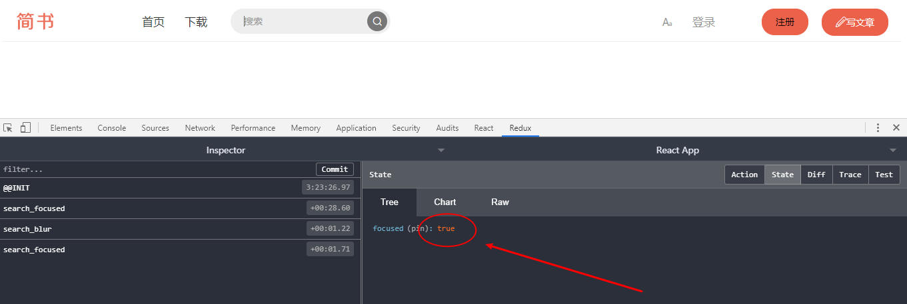
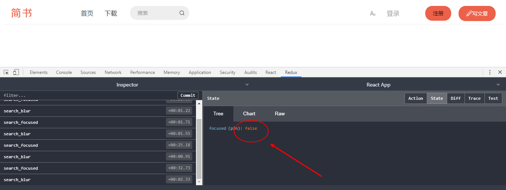
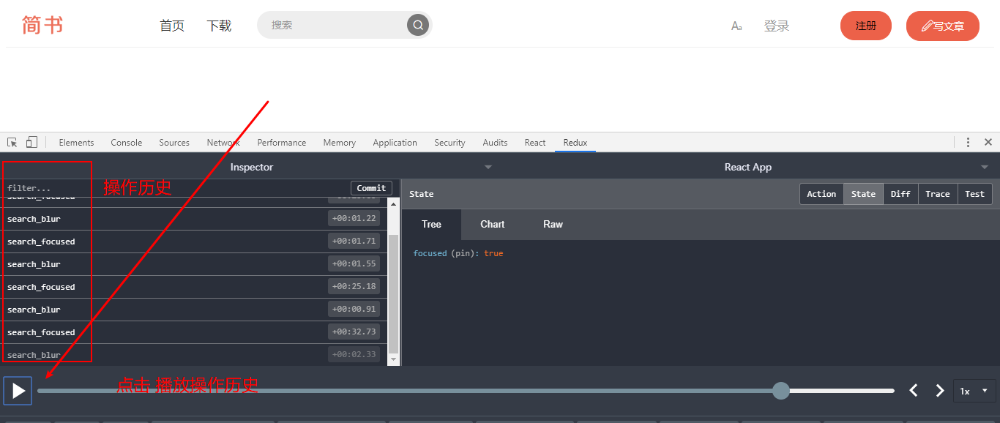
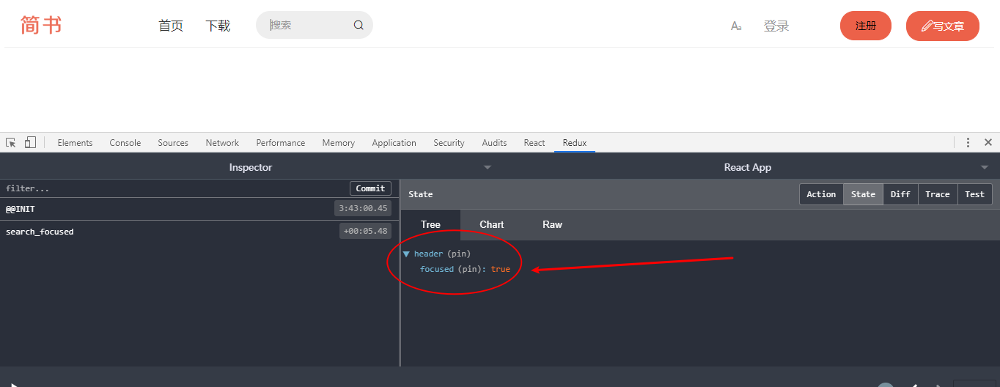

# React 简书项目

## 项目启动

- 开启项目：`create-react-app jianshu`
- 删除不必要的文件，删除后目录如下：

```bash
src
├── App.js
├── index.css
└── index.js
```

- 使用 styled-components 对 css 进行统一管理：`yarn add styled-components` 
- 将 `style.css` 改名为 `style.js` ，使用 `styled-components` 语法， 从 [reset.css](https://meyerweb.com/eric/tools/css/reset/) 网站中 copy 相关代码

```js
import { createGlobalStyle } from 'styled-components';

export const Globalstyle = createGlobalStyle`
  html, body, div, span, applet, object, iframe,
  h1, h2, h3, h4, h5, h6, p, blockquote, pre,
  a, abbr, acronym, address, big, cite, code,
  del, dfn, em, img, ins, kbd, q, s, samp,
  small, strike, strong, sub, sup, tt, var,
  b, u, i, center,
  dl, dt, dd, ol, ul, li,
  fieldset, form, label, legend,
  table, caption, tbody, tfoot, thead, tr, th, td,
  article, aside, canvas, details, embed, 
  figure, figcaption, footer, header, hgroup, 
  menu, nav, output, ruby, section, summary,
  time, mark, audio, video {
    margin: 0;
    padding: 0;
    border: 0;
    font-size: 100%;
    font: inherit;
    vertical-align: baseline;
  }
  /* HTML5 display-role reset for older browsers */
  article, aside, details, figcaption, figure, 
  footer, header, hgroup, menu, nav, section {
    display: block;
  }
  body {
    line-height: 1;
  }
  ol, ul {
    list-style: none;
  }
  blockquote, q {
    quotes: none;
  }
  blockquote:before, blockquote:after,
  q:before, q:after {
    content: '';
    content: none;
  }
  table {
    border-collapse: collapse;
    border-spacing: 0;
  }
`;
```

- 在 `App.js` 文件中使用它

```js
import React from 'react';
import { Globalstyle } from './style';

function App() {
  return (
    <div className="App">
      <Globalstyle /> 
       <header className="App-header">  
        <h1>hello,world!</h1>
      </header>
    </div>
  );
}

export default App;

```


## 使用 Styled-components

学习 `styled-components` 语法， 定义有样式的组件：

[styled-components 官网](https://www.styled-components.com/docs/basics#getting-started)

基本格式

```js
export const HeaderWrapper = styled.div`
    position: relative;
    height: 58px;
    border-bottom: 1px solid #f0f0f0;
`;
```

使用 `&` 的格式

```js
export const NavItem = styled.div`
   line-height: 56px;
   padding: 0 15px;
   color: #333;
   font-size: 17px;
   &.left{
       float: left;
   }
   &.right{
       float: right;
       color: #969696;
   }
   $.active{
       color: #ea6f5a;
   }
`;
```

等价于

```css
NavItem{
   line-height: 56px;
   padding: 0 15px;
   color: #333;
   font-size: 17px;
}
NavItem.left {
	float: left;
}
NavItem.right {
	float: right;
    color: #969696;
}
NavItem.active {
    color: #ea6f5a;
}
```

定义属性

 ```js
export const NavSearch = styled.input.attrs({
    placeholder: '搜索'
})`
    margin-top: 9px;
    margin-left: 20px;
`;
 ```


## icon-font 嵌入头部图标

学习从 [icon-font](https://www.iconfont.cn/)  获取图标，下载后解压到项目目录中

使用 `styled-components` 语法引入图片文件

```js
import logoPic from '../../statics/logo.png'

export const Logo = styled.a`
    position: absolute;
    top: 0;
    left: 0;
    display: block;
    width: 100px;
    height: 58px;
    background: url(${logoPic});
    background-size: contain;
`;
```

对于 iconfont 图片在项目中的使用，详情参考 [帮助](https://www.iconfont.cn/help/detail?spm=a313x.7781069.1998910419.d8cf4382a&helptype=code)，在将图片加入购物车以后，下载压缩包中含有使用说明文件。


## 搜索框动画效果的实现

使用 `state` 控制 `className` 的方式更改样式

```js
constructor(props){
        super(props);
        this.state = {
            focused: false
        };
    }

<span className={this.state.focused ? 'focused iconfont': 'iconfont'}>&#xe617;</span>
```


聚焦 和 失焦 逻辑的编写

```js
// index.js 文件
// 省略部分代码
constructor(props){
        super(props);
        this.state = {
            focused: false
        };
        this.handleInputFocus = this.handleInputFocus.bind(this);
        this.handleInputBlur = this.handleInputBlur.bind(this);
    }

render() {
    return (
    	 <NavSearch
           className={this.state.focused ? 'focused': ''}
           onFocus={this.handleInputFocus}
           onBlur={this.handleInputBlur}
           ></NavSearch>
    )
}

handleInputFocus() {
    this.setState({
    focused: true
    })
}
handleInputBlur() {
    this.setState({
    focused: false
    })
}
```


结合动画效果

- 安装` react-transition-group`： `yarn add react-transition-group`
- 使用 `CSSTransition ` ：

```js
import React, {Component} from 'react';
import {HeaderWrapper,Logo,Nav,NavItem,NavSearch,Addition,Button,SearchWrapper} from './style'
import {CSSTransition} from 'react-transition-group';
// header/index.js 文件
// 省略部分代码
<SearchWrapper>
    <CSSTransition
        timeout={200}
        in={this.state.focused}
        classNames="slide"
        >
        <NavSearch
            className={this.state.focused ? 'focused': ''}
            onFocus={this.handleInputFocus}
            onBlur={this.handleInputBlur}
            ></NavSearch>
    </CSSTransition>
	<span className={this.state.focused ? 'focused iconfont': 'iconfont'}>&#xe617;</span>
</SearchWrapper> 

// style.js 文件

export const NavSearch = styled.input.attrs({
    placeholder: '搜索'
})`
    margin-top: 9px;
    margin-left: 20px;
    padding: 0 30px 0 20px;
    box-sizing: border-box;
    width: 160px;
    height: 38px;
    border: none;
    outline: none;
    border-radius: 19px;
    background: #eee;
    font-size: 14px;
    color: #666;
    &::placeholder {
        color: #999;
    }
    &.focused {
        width: 240px;
        padding: 0 40px 0 20px;
    }
    &.slide-enter{
        width: 160px;
        transition: all .2s ease-out;
    }
    &.slide-enter-active{
        width: 240px;
    }
    &.slide-exit{
        transition: all .2s ease-out;
    }
    &.slide-exit-active{
        width: 160px;
    }
`;
```

需要注意，在使用 `CSSTransition` 的时候

- 使用 `CSSTransition` 标签**包裹单个元素**
- 设置三要素：`in` ，`timeout` ，`classNames` 
- 在 css 文件中，需要定义四要素：
  - `className-enter`
  - `className-enter-active`
  - `className-exit`
  - `className-exit-active`


## 使用 React-redux 进行数据的管理

`Redux` 安装和使用 

- [Redux 官网中文版](https://www.redux.org.cn/)

- 步骤
  - 使用 `createStore` 创建 `store`
  - 创建 `reducer`
  - 使用` Provider`， 关联 `store` 给其所有子组件

```js
import React from 'react';
import {Provider} from 'react-redux';
import { GlobalStyle } from './statics/icon-font/iconfont.js';
import Header from './common/header';
import store from './store';


function App() {
  return (
    <Provider className="App" store={store}>
      <GlobalStyle /> 
        <Header />
    </Provider>
  );
}

export default App;
```

- 将 `index.js` 文件中的 `state` 数据迁移到 `reducer.js` 文件中的 `defaultState` 。

```js
const defaultState = {
	focused: false
};

export default (state = defaultState, action) => {
	// ...
    return state;
}
```

- 使用 `connect` ，创建 `mapStateToProps`， `mapDispatchToProps` 

```js
import React, {Component} from 'react';

class Header extends Component {
	// ...
}

const mapStateToProps = (state)=> {
    return {
        focused: state.header.focused
    }
}
const mapDispatchToProps = (dispatch)=> {
    return {
        handleInputFocus() {
            // ...
        },
        handleInputBlur() {
           //...
        }
    }
}

export default connect(mapStateToProps, mapDispatchToProps)(Header);
```

- 映射 `state` 数据到 `mapStateToProps`，更改所有 `this.state.xxx` 为 `this.props.xxx`

- 映射 方法到 `mapDispatchToProps`，删掉原来的单独写在 `render` 函数后面的 `handleXXX` 方法和删除 `constructor` 中的 `this` 绑定

- 使用` redux `以后，不允许直接修改 `state` 的数据，需要提交 `action` ，`store` 拿到 `action` 后将旧数据一起给到 `reducer`， 通过 `reducer` 修改数据

- 修改 方法 `handleInputFocus`  和 `handleInputBlur`，使用提交 `action` 的方式将数据给到 `store` 然后给到 `reducer `；同时，编写 `reducer` 修改数据，它会返回给 `store `

此时，`Header` 组件没有逻辑代码，修改其为 **无状态组件**，同时改掉所有 `this.props` 为 `props`。

## 使用 combineReducers 完成对数据的拆分管理

1.工具的使用

无法使用开发者工具 redux，怎么办？

利用工具 [redux-devtools-extension](https://github.com/zalmoxisus/redux-devtools-extension)

使用方法，看文档：

我们测试工具的使用，鼠标在搜索框中时，看 state 里面的 focused



鼠标不在搜索框时



以及，当我们操作时，下面的工具可以 **播放** 我们做过的事情。




2.使用 `combineReducers `

当前数据都存储在` reducer.js` 文件中，后面的开发中，随着业务的复杂性越大，数据量就越多，我们并不建议将所有的数据都放在 `reducer.js` 文件中，而是将数据分开成小的 `store`，然后整合在总的 `store` 里进行管理。

在 `src/common/header` 中新建目录 `store` ，在里面新建文件 `reducer.js` 文件，将前面的总的 `store` 中 `reducer.js` 中代码拷贝进去

在总的 `store/reducer.js` 文件引入 `header/store/reducer.js` 文件，然后使用 `combineReducers` 进行整合

```js
import {combineReducers}  from 'redux';
import headReducer from '../common/header/store/reducer';

export default combineReducers({
    header: headReducer 
})
```

这个时候，我们回到页面，发现没有报错，但是点击搜索框时发现， `Redux-dev-tools` 中的 数据发生了变化，但是页面无法获取变化后的数据，从而无法触发动画效果，这是为什么呢？

因为我们的数据中，多了一层 `header`，如下图



既然是多了一层 `header` ，那么我们获取数据，自然也是要从 `header` 的 `state` 中获取数据才能够给到页面，从而正确触发动画效果。

```js
// src/common/header/index.js 文件修改代码如下

// 旧代码
const mapStateToProps = (state)=> {
    return {
        focused: state.focused
    }
}

//新代码
const mapStateToProps = (state)=> {
    return {
        focused: state.header.focused //这里发生变更
    }
}
```

以上，我们就学会了使用 `combineReducers` 。

这个时候，其实，我们还可以将代码优化下，我们看：

```js
import headReducer from '../common/header/store/reducer';
```

这里，我们引用 `headReducer` 的路径太长了，我们可以优化下：

在 `common/header/store`  目录下创建 `index.js` 文件，代码为

```js
import reducer from './reducer';

export {reducer};
```

这个时候，我们的总的 `store` 下的 `reducer` 文件，就可以这么写：

```js
import {combineReducers}  from 'redux';
import {reducer as headReducer} from '../common/header/store';

const reducer = combineReducers({
    header: headReducer
})

export default reducer;
```

因为引入的名字为 `reducer` 和下面定义的常量 `reducer` 重名，这个时候，我们使用 ES6 语法 `as` ，对其改名为 `headReducer` 即可正常使用。

## actionCreators 与 constants 的拆分

在 `common/header/store` 目录下创建文件 `actionCreators.js`  代码编写为

```js
export const searchFocus = () => ({
    type: 'search_focused'
});

export const searchBlur = () => ({
    type: 'search_blur'
});
```

然后，`common/header/index.js` 文件中，引入上面 `actionCreators` ，同时，对应的触发 `action` 代码需要修改

```js
import * as actionCreators from './store/actionCreators';

// 省略部分代码...
// 旧代码
const mapDispatchToProps = (dispatch)=> {
    return {
        handleInputFocus() {
            const action = {
                type: 'search_focused'
            }
            dispatch(action);
        },
        handleInputBlur() {
             const action = {
                type: 'search_blur'
            }
            dispatch(action);
        }
    }
}

// 新代码
const mapDispatchToProps = (dispatch)=> {
    return {
        handleInputFocus() {
            dispatch(actionCreators.searchFocus());
        },
        handleInputBlur() {
            dispatch(actionCreators.searchBlur());
        }
    }
}
```

对于上面的` action` 中的 `type`，为了避免找错麻烦，我们需要**对字符串进行统一管理**

常量管理，取名为 `actionTypes.js` 或 `constants.js` 都可以

```js
// constants.js 文件
export const SEARCH_FOCUS = 'header/SEARCH_FOCUS';
export const SEARCH_BLUR = 'header/SEARCH_BLUR';
```

接着，`actionCreators.js` 文件也需要对应修改

```js
import * as actionTypes from './contants';

export const searchFocus = () => ({
    type: actionTypes.SEARCH_FOCUS
});

export const searchBlur = () => ({
    type: actionTypes.SEARCH_BLUR
});
```

此时，我们在浏览器打开测试，**虽然没有报错，但是依然还有问题**，因为，我们还没有修改 `reducer.js` 文件

**我们需要保证 actionTypes，actionCreators，reducer ，index 中的字符串常量保持统一！**

```js
import * as actionTypes from './contants';

const defaultState = {
    focused: false
};

export default (state = defaultState, action) => {

    if(action.type === actionTypes.SEARCH_FOCUS) {
        return {
            focused: true
        } 
    }

    if(action.type === actionTypes.SEARCH_BLUR) {
        return {
            focused: false
        }
    }

    return state;
}
```


以上，我们就实现了对 `actionCreators` 和 `constants` 的拆分。

事实上，对现在的代码，我们还可以有优化的地方。

**将 common/header/store/index.js 作为 store 中的出口文件，我们所有的资源都统一从这里获取。**

所以，我们需要把 `actionCreators` 也引入其中，再通过它导出

```js
import reducer from './reducer';
import * as actionCreators from './actionCreators'

export  {reducer, actionCreators};
```

这样一来，我们在 `header/index.js` 中就可以这么写，从而少引用一层目录。

```js
//旧代码
import * as actionCreators from './store/actionCreators';

//新代码
import {actionCreators} from './store';
```


## 使用 immutable.js  来管理 store 中的数据

对于 `reducer.js` 中的 `state`，新手往往不小心就将 `state` 更改了，然后 代码报错，不好找错。

```js
import * as actionTypes from './contants';

const defaultState = {
    focused: false
};
    
export default (state = defaultState, action) => {

    if(action.type === actionTypes.SEARCH_FOCUS) {
        return {
            focused: true
        } 
    }

    if(action.type === actionTypes.SEARCH_BLUR) {
        return {
            focused: false
        }
    }

    return state;
}
```

为了避免这个问题，**确保一定不能修改 state，我们需要使用 immutable.js 库** 

> immutable.js 是 Facebook 历时3年开发的一个库，原理是生成一个 immutable 对象，这个对象是不可改变的。联想到 state 也是不允许改变的，我们需要将 state 变成 immutable 对象。

- 官网：[immutable-js](https://github.com/immutable-js/immutable-js)
- 安装： `yarn add immutable`
- 使用方法：

```js
//reducer.js 文件
// 旧代码
import * as actionTypes from './contants';

const defaultState = {
    focused: false
};

export default (state = defaultState, action) => {
    if(action.type === actionTypes.SEARCH_FOCUS) {
        return {
            focused: true
        } 
    }
    if(action.type === actionTypes.SEARCH_BLUR) {
        return {
            focused: false
        }
    }
    return state;
}

//--------------------------------------
// 新代码
import * as actionTypes from './contants';
import {fromJS} from 'immutable';

const defaultState = fromJS({
    focused: false
});

export default (state = defaultState, action) => {
    if(action.type === actionTypes.SEARCH_FOCUS) {
        return state.set('focused',true);
    }
    if(action.type === actionTypes.SEARCH_BLUR) {
        return state.set('focused',false);
    }
    return state;
}
```

重点： **immutable对象的 set 方法，会结合之前 immutable对象的值和设置的值，返回一个全新的对象，而不会去改变 state** 

对应的，既然不能更改 `immutable` 对象，我们在获取 `state` 的数据的时候，也不能再使用 `state.focused` 来获取了，而是使用下面的方式：

```js
//旧代码
const mapStateToProps = (state)=> {
    return {
        focused: state.header.focused
    }
}

//新代码
const mapStateToProps = (state)=> {
    return {
        focused: state.header.get('focused')
    }
}
```

